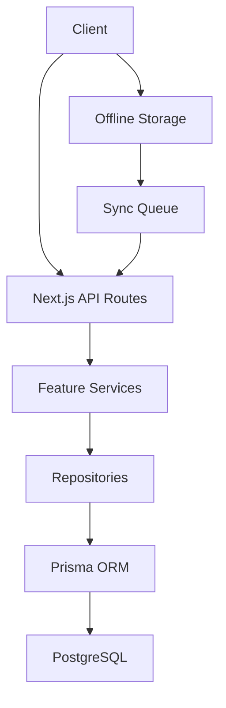
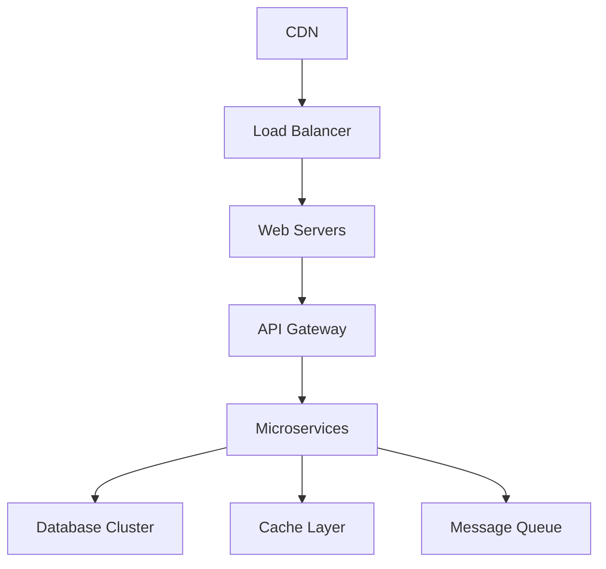
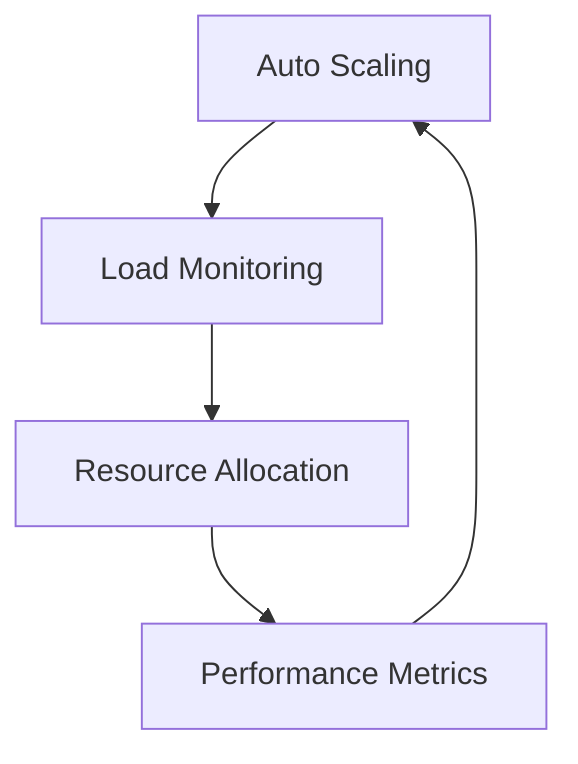
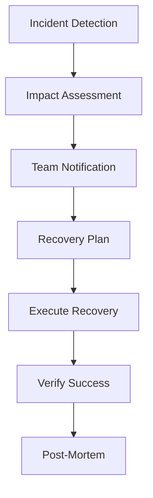

# Write Care Notes - Technical Architecture

## Directory Structure Overview

```bash
├── app/                    # Next.js 13+ App Router (Pages & API Routes)
│   ├── api/               # API Routes (grouped by feature)
│   │   ├── auth/         # Authentication endpoints
│   │   ├── care-homes/    # Care Home API
│   │   ├── residents/    # Residents API
│   │   ├── staff/         # Staff API
│   │   └── [feature]/    # Feature-specific APIs
│   ├── (auth)/           # Auth-required route group
│   │   ├── dashboard/    # Dashboard pages
│   │   ├── care-homes/    # Care Home pages
│   │   ├── residents/    # Residents pages
│   │   ├── staff/         # Staff pages
│   │   └── [feature]/    # Feature pages
│   ├── about/            # Public pages
│   └── layout.tsx        # Root layout
├── src/                   # Source Code (Business Logic & Components)
│   ├── components/       # Shared Components
│   │   ├── ui/          # Base UI components (Radix UI + Tailwind)
│   │   │   ├── button/
│   │   │   ├── form/
│   │   │   └── data-display/
│   │   ├── layout/      # Layout components
│   │   └── shared/      # Cross-feature components
│   ├── features/        # Feature Modules
│   │   ├── care-homes/  # Care Home Module
│   │   │   ├── api/    # Care Home API layer
│   │   │   ├── components/ # Care Home components
│   │   │   ├── hooks/  # Care Home hooks
│   │   │   ├── i18n/   # Translations
│   │   │   ├── repositories/ # Data access
│   │   │   ├── services/ # Business logic
│   │   │   ├── types/  # Type definitions
│   │   │   └── utils/  # Utilities
│   │   └── [feature]/   # Other features
│   ├── lib/            # Core Utilities
│   │   ├── db.ts      # Database client
│   │   ├── auth.ts    # Auth utilities
│   │   ├── offline/   # Offline support
│   │   ├── i18n/      # Internationalization
│   │   └── api.ts     # API utilities
│   └── types/         # Global TypeScript types
├── prisma/            # Database Layer
│   ├── schema.prisma  # Database schema
│   └── migrations/    # Database migrations
└── public/           # Static assets
```

## Core Features

### Offline Support
- IndexedDB for local storage
- Background sync
- Conflict resolution
- Version control
- Network status monitoring

### Multi-Tenant Architecture
- Organization isolation
- Department segregation
- Role-based access
- Data partitioning
- Cross-tenant features

### Internationalization
- Multiple language support
- Regional formatting
- RTL support
- Accessibility compliance
- Translation management

### Enterprise Security
- Data encryption
- Access control
- Audit logging
- GDPR compliance
- Security headers

## Feature Modules

### Care Home Module
The Care Home module provides enterprise-grade care home management with:
- Offline-first architecture
- Multi-tenant support
- Full i18n support (EN/CY)
- Care home management
- Staff management
- Resident management
- Care plan management
- Compliance management
- Analytics and reporting

### Payroll Module
The Payroll module provides comprehensive payroll management capabilities with:
- Secure salary processing
- Multi-currency support
- Tax calculations and compliance
- Time tracking integration
- Leave management
- Overtime calculations
- Payslip generation
- Direct deposit support
- Audit trail
- Historical records

#### Directory Structure
```bash
src/features/payroll/
├─��� api/                # Payroll API endpoints
│   ├── handlers/      # Request handlers
│   └── routes/        # API route definitions
├── components/        # Payroll UI components
│   ├── forms/         # Salary, tax forms
│   ├── tables/        # Payroll data tables
│   └── reports/       # Financial reports
├── repositories/      # Data access layer
│   ├── payrollRepository.ts
│   └── taxRepository.ts
├── services/         # Business logic
│   ├── calculationService.ts
│   ├── taxService.ts
│   └── reportingService.ts
├── types/            # Type definitions
└── utils/            # Utility functions
```

#### Key Features
- **Salary Processing**
  - Multiple pay periods (weekly, bi-weekly, monthly)
  - Bonus and commission handling
  - Deduction management
  - Tax compliance

- **Time Integration**
  - Automatic timesheet import
  - Overtime calculation
  - Leave balance tracking
  - Holiday pay processing

- **Compliance & Security**
  - HMRC compliance
  - Data encryption
  - Role-based access
  - Audit logging
  - Data retention policies

- **Reporting**
  - Payroll summaries
  - Tax reports
  - Cost center analysis
  - Custom report generation

## Medication Management Architecture

## Overview
The medication management system is designed to be enterprise-grade, compliant with healthcare regulations, and capable of offline operation. It follows a layered architecture pattern with clear separation of concerns.

## Core Components

### 1. Data Layer
- **Repository Pattern**: Abstracts database operations
- **Caching Strategy**: Redis for performance optimization
- **Offline Storage**: IndexedDB for offline-first capabilities
- **Data Validation**: Zod schema validation
- **Audit Logging**: Comprehensive audit trail for all operations

### 2. Service Layer
- **Business Logic**: Medication service with CRUD operations
- **Error Handling**: Standardized error types and handling
- **Validation**: Input validation and business rule enforcement
- **Caching**: Intelligent caching with invalidation
- **Security**: Role-based access control

### 3. API Layer
- **REST Endpoints**: RESTful API design
- **GraphQL Support**: Optional GraphQL interface
- **Rate Limiting**: Request throttling
- **Versioning**: API versioning support
- **Documentation**: OpenAPI/Swagger specs

### 4. UI Components
- **React Components**: Reusable UI building blocks
- **State Management**: React Query for server state
- **Offline Support**: Optimistic updates and sync
- **Accessibility**: WCAG 2.1 AA compliant
- **Error Boundaries**: Graceful error handling

## Security Features

### Authentication & Authorization
- Multi-factor authentication support
- Role-based access control (RBAC)
- Session management
- Audit logging

### Medication Verification
- PIN verification system
- Barcode scanning support
- Double signature requirement
- Attempt tracking and lockout
- Device fingerprinting

### Data Protection
- End-to-end encryption
- Data anonymization
- GDPR compliance
- Secure offline storage

## Offline Capabilities

### Sync Strategy
1. **Queue Management**
   - Persistent operation queue
   - Conflict resolution
   - Retry mechanism

2. **Data Storage**
   - IndexedDB for offline data
   - Sync status tracking
   - Background sync

3. **UI Feedback**
   - Sync status indicators
   - Error handling
   - Optimistic updates

## Performance Optimization

### Caching Strategy
1. **Application Cache**
   - React Query cache
   - Stale-while-revalidate
   - Prefetching

2. **API Cache**
   - Redis cache layer
   - Cache invalidation
   - Cache warming

### Monitoring
- Performance metrics
- Error tracking
- Usage analytics
- Audit trail

## Compliance & Regulations

### Healthcare Standards
- HIPAA compliance
- NHS Digital standards
- Regional healthcare regulations
- Data protection requirements

### Audit Requirements
- Complete audit trail
- User action logging
- System event logging
- Data access tracking

## Deployment & Scaling

### Infrastructure
- Containerized deployment
- Horizontal scaling
- Load balancing
- High availability

### Monitoring & Alerts
- Health checks
- Performance monitoring
- Error alerting
- Usage analytics

## Future Considerations

### Planned Enhancements
- AI-powered drug interaction checks
- Advanced analytics dashboard
- Mobile application support
- Integration with external systems

### Integration Points
- Electronic Health Records (EHR)
- Pharmacy systems
- Insurance providers
- Regulatory reporting

## Feature Modules

The application is organized into feature modules under `src/features/`:

### Core Features
- **Care Home Management** (`carehome/`)
  - Care home profile management
  - Staff scheduling and management
  - Facility management
  
- **Resident Care** (`resident/`)
  - Resident profiles and records
  - Care plan management
  - Daily activity logging
  
- **Clinical** (`medications/`, `assessments/`)
  - Medication administration
  - Health assessments
  - Treatment plans
  
- **Family Portal** (`family-portal/`)
  - Family communication
  - Visit scheduling
  - Updates and notifications

### Business Operations
- **Financial Management** (`financial/`, `accounting/`)
  - Billing and invoicing
  - Expense tracking
  - Financial reporting
  
- **Compliance & Audit** (`compliance/`, `audit/`)
  - Regulatory compliance
  - Quality assurance
  - Audit trails
  
- **Resource Management** (`bed-management/`, `devices/`)
  - Bed allocation
  - Equipment tracking
  - Resource scheduling

### Support Features
- **Activities** (`activities/`)
  - Resident activities planning
  - Group events
  - Activity logs
  
- **Organizations** (`organizations/`)
  - Multi-tenant management
  - Organization settings
  - Role management

### Advanced Features
- **Telehealth** (`telehealth/`)
  - Remote consultations
  - Health monitoring
  - Digital health records

## Emergency Access Management
The Emergency Access module provides enterprise-grade emergency access control with:
- Real-time access monitoring dashboard
- Role-based emergency access controls
- Automated access request workflow
- Time-limited access grants
- Access revocation system
- Comprehensive audit logging
- Compliance with healthcare regulations
- Integration with notification system
- Emergency protocols management

### Core Components
- Real-time dashboard for emergency access monitoring
- Role-based access control system with emergency override capabilities
- Emergency access workflow engine with approval chains
- Audit logging and compliance tracking system

### Technical Implementation
- **Access Control**
  - Time-boxed access grants (4-hour maximum)
  - Role-based permission system
  - Multi-step approval workflow
  - Access revocation mechanism

- **Monitoring & Alerts**
  - Real-time status monitoring
  - Automated notification system
  - Escalation paths configuration
  - Integration with existing alert systems

- **Compliance & Audit**
  - Comprehensive audit trails
  - Healthcare regulation compliance
  - Post-access review system
  - Risk assessment integration

- **Data Model**
  ```typescript
  interface EmergencyAccess {
    id: string
    userId: string
    resourceType: ResourceType
    resourceId: string
    reason: string
    approvedBy?: string
    startTime: Date
    endTime: Date
    isActive: boolean
    auditTrail: EmergencyAccessAudit[]
  }

  interface EmergencyAccessWorkflow {
    id: string
    emergencyAccessId: string
    requiredApprovals: number
    approvers: Array<{
      userId: string
      role: Role
      status: 'PENDING' | 'APPROVED' | 'REJECTED'
      timestamp?: Date
      reason?: string
    }>
    status: 'PENDING' | 'APPROVED' | 'REJECTED'
    expiresAt: Date
    riskLevel: 'LOW' | 'MEDIUM' | 'HIGH'
    notifications: {
      channels: ('EMAIL' | 'SMS' | 'SLACK')[]
      escalation: boolean
      lastNotified?: Date
      escalationLevel: number
    }
    postAccessReview: boolean
    reviewCompleted?: boolean
    reviewNotes?: string
  }
  ```

## Technical Implementation

### State Management
- Server state: React Query
- Client state: Context API
- Offline state: IndexedDB + SWR

### Data Flow


### Security Architecture
- JWT-based authentication
- Role-based access control (RBAC)
- Row-level security in PostgreSQL
- End-to-end encryption for sensitive data

### Performance Optimizations
- Static page generation where possible
- Dynamic imports for code splitting
- Redis caching layer
- CDN for static assets

### Offline Capabilities
- Service Worker for asset caching
- IndexedDB for data persistence
- Background sync for pending changes
- Conflict resolution strategies

## Naming Conventions

### Files & Directories
```bash
# Components (PascalCase)
CareHomeDashboard.tsx
ResidentProfile.tsx
StaffSchedule.tsx

# Hooks (camelCase with 'use' prefix)
useCareHome.ts
useResident.ts
useStaff.ts

# Utils (camelCase)
validation.ts
formatters.ts
constants.ts

# Types (PascalCase with type context)
CareHomeTypes.ts
ResidentModel.ts
APITypes.ts

# API Routes (kebab-case)
app/api/care-homes/route.ts
app/api/residents/[id]/route.ts
```

## Feature Module Structure

Each feature follows this standardized structure:

```bash
src/features/[feature]/
├── api/                 # API Layer
│   ├── index.ts        # API endpoints
│   ├── validation.ts   # Request/response validation
│   └── types.ts        # API-specific types
├── components/         # UI Components
│   ├── forms/         # Feature forms
│   ├── lists/         # List/table views
│   └── details/       # Detail views
├── hooks/             # React Hooks
│   ├── useFeature.ts  # Main feature hook
│   └── useActions.ts  # Feature actions
├── types/            # Feature Types
│   ├── index.ts     # Type exports
│   └── models.ts    # Domain models
└── index.ts         # Public API
```

## API Route Patterns

### Route Handler Structure
```typescript
// app/api/[feature]/route.ts
import { validateRequest } from '@/lib/api'
import { handleError } from '@/lib/errors'
import { prisma } from '@/lib/db'

export async function GET(req: Request) {
  try {
    // 1. Validate request & auth
    const { user, query } = await validateRequest(req)
    
    // 2. Process request
    const data = await prisma.entity.findMany({
      where: {
        organizationId: user.organizationId,
        ...query
      }
    })
    
    // 3. Return response
    return Response.json({ data })
  } catch (error) {
    return handleError(error)
  }
}
```

### Middleware Pattern
```typescript
// middleware.ts
import { withAuth } from '@/lib/auth'
import { rateLimit } from '@/lib/api'

export default withAuth({
  callbacks: {
    authorized: async ({ req, token }) => {
      // Custom auth logic
      return !!token
    }
  },
  pages: {
    signIn: '/auth/login',
    error: '/auth/error'
  }
})
```

## State Management

### React Query Pattern
```typescript
// src/features/[feature]/hooks/useFeature.ts
import { useQuery, useMutation, useQueryClient } from '@tanstack/react-query'
import { api } from '../api'

export function useFeature() {
  const queryClient = useQueryClient()
  
  // Queries
  const { data, isLoading } = useQuery({
    queryKey: ['feature'],
    queryFn: api.list
  })
  
  // Mutations
  const { mutate } = useMutation({
    mutationFn: api.create,
    onSuccess: () => {
      queryClient.invalidateQueries(['feature'])
    }
  })
  
  return {
    data,
    isLoading,
    create: mutate
  }
}
```

## Component Patterns

### Base Component Pattern
```typescript
// src/components/ui/button/Button.tsx
import { forwardRef } from 'react'
import { cva, type VariantProps } from 'class-variance-authority'
import { cn } from '@/lib/utils'

const buttonVariants = cva(
  'inline-flex items-center justify-center rounded-md text-sm font-medium',
  {
    variants: {
      variant: {
        default: 'bg-primary text-white hover:bg-primary/90',
        secondary: 'bg-secondary text-white hover:bg-secondary/90',
        outline: 'border border-input bg-transparent hover:bg-accent',
      },
      size: {
        default: 'h-10 px-4 py-2',
        sm: 'h-9 px-3',
        lg: 'h-11 px-8',
      },
    },
    defaultVariants: {
      variant: 'default',
      size: 'default',
    },
  }
)

export interface ButtonProps extends 
  React.ButtonHTMLAttributes<HTMLButtonElement>,
  VariantProps<typeof buttonVariants> {
  asChild?: boolean
}

const Button = forwardRef<HTMLButtonElement, ButtonProps>(({
  className,
  variant,
  size,
  asChild = false,
  ...props
}, ref) => {
  return (
    <button
      className={cn(buttonVariants({ variant, size, className }))}
      ref={ref}
      {...props}
    />
  )
})
Button.displayName = 'Button'

export { Button, buttonVariants }
```

## Form Handling Pattern

### Form Component Pattern
```typescript
// src/features/[feature]/components/forms/FeatureForm.tsx
import { useForm } from 'react-hook-form'
import { zodResolver } from '@hookform/resolvers/zod'
import { type FormData, formSchema } from '../../types'

export function FeatureForm() {
  const form = useForm<FormData>({
    resolver: zodResolver(formSchema),
    defaultValues: {
      // ...
    }
  })
  
  const onSubmit = async (data: FormData) => {
    // Handle submission
  }
  
  return (
    <form onSubmit={form.handleSubmit(onSubmit)}>
      {/* Form fields */}
    </form>
  )
}
```

## Error Handling Pattern

### API Error Pattern
```typescript
// src/lib/api/errors.ts
export class APIError extends Error {
  constructor(
    message: string,
    public statusCode: number,
    public code: string,
    public context?: Record<string, any>
  ) {
    super(message)
    this.name = 'APIError'
  }
  
  static notFound(resource: string) {
    return new APIError(
      `${resource} not found`,
      404,
      'NOT_FOUND'
    )
  }
  
  static unauthorized() {
    return new APIError(
      'Unauthorized',
      401,
      'UNAUTHORIZED'
    )
  }
}
```

## Validation Pattern

### Schema Validation
```typescript
// src/features/[feature]/types/schema.ts
import { z } from 'zod'

export const featureSchema = z.object({
  id: z.string().cuid(),
  name: z.string().min(2).max(100),
  type: z.enum(['TYPE_A', 'TYPE_B']),
  status: z.enum(['ACTIVE', 'INACTIVE']),
  metadata: z.record(z.string(), z.unknown()).optional(),
  createdAt: z.date(),
  updatedAt: z.date()
})

export type Feature = z.infer<typeof featureSchema>
```

## Testing Pattern

### Component Test Pattern
```typescript
// src/features/[feature]/__tests__/Component.test.tsx
import { render, screen } from '@testing-library/react'
import { Component } from '../components/Component'

describe('Component', () => {
  it('renders successfully', () => {
    render(<Component />)
    expect(screen.getByRole('button')).toBeInTheDocument()
  })
  
  it('handles user interaction', async () => {
    const onAction = vi.fn()
    render(<Component onAction={onAction} />)
    
    await userEvent.click(screen.getByRole('button'))
    expect(onAction).toHaveBeenCalled()
  })
})
```

## Database Pattern

### Prisma Schema Organization
```prisma
// prisma/schema.prisma

// Core models
model CareHome {
  id        String   @id @default(cuid())
  name      String
  type      String
  status    String
  address   Address
  region    Region
  regulatoryBody RegulatoryBody
  compliance ComplianceStatus
  staff     Staff[]
  residents Resident[]
  carePlans CarePlan[]
  createdAt DateTime @default(now())
  updatedAt DateTime @updatedAt
  
  // Relations
  facilities Facility[]
  users      User[]
}

// Feature models
model Resident {
  id          String   @id @default(cuid())
  careHomeId  String
  careHome    CareHome @relation(fields: [careHomeId], references: [id])
  
  // Feature-specific fields
  careLevel   String
  roomNumber  String?
  status      String
  
  // Common fields
  createdAt   DateTime @default(now())
  updatedAt   DateTime @updatedAt
  
  // Relations
  carePlans   CarePlan[]
  medications Medication[]
}
```

## Authentication Pattern

### Auth Middleware Pattern
```typescript
// src/lib/auth/middleware.ts
import { getToken } from 'next-auth/jwt'
import { withAuth } from 'next-auth/middleware'

export default withAuth({
  callbacks: {
    authorized: async ({ req, token }) => {
      // Custom auth logic
      return !!token
    }
  },
  pages: {
    signIn: '/auth/login',
    error: '/auth/error'
  }
})
```

## Deployment Pattern

### Environment Configuration
```bash
# .env.production
DATABASE_URL="postgresql://..."
REDIS_URL="redis://..."
AZURE_STORAGE_CONNECTION="..."
NEXT_PUBLIC_API_URL="https://api.writecarenotes.com"
```

### Build Configuration
```json
// package.json
{
  "scripts": {
    "build": "next build",
    "start": "next start",
    "lint": "next lint",
    "test": "jest",
    "migrate": "prisma migrate deploy"
  }
}
```

## Offline Architecture

### Service Worker Strategy
```typescript
// src/lib/offline/service-worker.ts
class OfflineManager {
  private static instance: OfflineManager
  private syncQueue: SyncQueue
  private conflictResolver: ConflictResolver

  async initialize(): Promise<void> {
    // Register service worker
    if ('serviceWorker' in navigator) {
      await navigator.serviceWorker.register('/sw.js')
    }
    
    // Initialize IndexedDB
    await this.initializeStorage()
  }

  async handleSync(): Promise<void> {
    const pendingActions = await this.syncQueue.getPending()
    for (const action of pendingActions) {
      await this.processOfflineAction(action)
    }
  }
}
```

### Offline Data Flow
1. **Data Storage**
```typescript
// src/lib/offline/storage.ts
export class OfflineStorage {
  private db: IDBDatabase

  async store(key: string, data: any): Promise<void> {
    const tx = this.db.transaction('offlineStore', 'readwrite')
    await tx.objectStore('offlineStore').put(data, key)
  }

  async retrieve(key: string): Promise<any> {
    const tx = this.db.transaction('offlineStore', 'readonly')
    return tx.objectStore('offlineStore').get(key)
  }
}
```

2. **Sync Queue**
```typescript
// src/lib/offline/sync-queue.ts
interface SyncAction {
  id: string
  type: 'CREATE' | 'UPDATE' | 'DELETE'
  resource: string
  data: any
  timestamp: number
}

export class SyncQueue {
  async add(action: SyncAction): Promise<void> {
    await storage.store(`sync:${action.id}`, action)
  }

  async process(): Promise<void> {
    const actions = await this.getPending()
    // Process actions in order
  }
}
```

3. **Conflict Resolution**
```typescript
// src/lib/offline/conflict.ts
export class ConflictResolver {
  async resolve(serverData: any, clientData: any): Promise<any> {
    // Implement resolution strategy
    // - Last write wins
    // - Manual resolution
    // - Custom merge logic
  }
}
```

## Regional Support

### Region Configuration
```typescript
// src/lib/regional/config.ts
export const REGIONS = {
  ENGLAND: {
    code: 'en-GB',
    regulator: 'CQC',
    currency: 'GBP',
    dateFormat: 'DD/MM/YYYY',
    timezone: 'Europe/London'
  },
  WALES: {
    code: 'cy-GB',
    regulator: 'CIW',
    currency: 'GBP',
    dateFormat: 'DD/MM/YYYY',
    timezone: 'Europe/London'
  },
  SCOTLAND: {
    code: 'gd-GB',
    regulator: 'Care Inspectorate',
    currency: 'GBP',
    dateFormat: 'DD/MM/YYYY',
    timezone: 'Europe/London'
  },
  IRELAND: {
    code: 'en-IE',
    regulator: 'HIQA',
    currency: 'EUR',
    dateFormat: 'DD/MM/YYYY',
    timezone: 'Europe/Dublin'
  },
  NORTHERN_IRELAND: {
    code: 'en-GB',
    regulator: 'RQIA',
    currency: 'GBP',
    dateFormat: 'DD/MM/YYYY',
    timezone: 'Europe/London'
  }
} as const

export type Region = keyof typeof REGIONS
```

### Regional Middleware
```typescript
// src/lib/regional/middleware.ts
import { type Region, REGIONS } from './config'

export function withRegion(handler: NextApiHandler) {
  return async (req: Request): Promise<Response> => {
    const region = req.headers['x-region'] as Region
    if (!region || !REGIONS[region]) {
      throw new APIError('Invalid region', 400)
    }

    // Apply regional context
    req.region = REGIONS[region]
    // Apply tenant-specific middleware
    return this.applyTenantMiddleware(req)
  }
}
```

### Regional Components
```typescript
// src/components/regional/RegionalProvider.tsx
import { createContext, useContext } from 'react'
import { type Region, REGIONS } from '@/lib/regional/config'

const RegionalContext = createContext<Region>('ENGLAND')

export function RegionalProvider({ 
  region,
  children 
}: { 
  region: Region
  children: React.ReactNode 
}) {
  return (
    <RegionalContext.Provider value={region}>
      {children}
    </RegionalContext.Provider>
  )
}

export function useRegion() {
  return useContext(RegionalContext)
}
```

## Language Support

### Translation System
```typescript
// src/lib/i18n/translate.ts
import { createI18n } from 'next-international'

export const { useI18n, I18nProvider } = createI18n({
  en: () => import('./locales/en.json'),
  cy: () => import('./locales/cy.json'),
  gd: () => import('./locales/gd.json'),
  ga: () => import('./locales/ga.json')
})

// Usage in components
export function TranslatedComponent() {
  const { t } = useI18n()
  return <h1>{t('welcome.title')}</h1>
}
```

### Language Files Structure
```bash
src/lib/i18n/locales/
├── en/                 # English
│   ├── common.json    # Shared translations
│   ├── auth.json      # Auth-specific translations
│   └── [feature].json # Feature-specific translations
├── cy/                 # Welsh
├── gd/                 # Scottish Gaelic
└── ga/                 # Irish
```

### Regional Date/Time Handling
```typescript
// src/lib/i18n/datetime.ts
import { format } from 'date-fns'
import { enGB, cy, gd } from 'date-fns/locale'

const locales = {
  'en-GB': enGB,
  'cy-GB': cy,
  'gd-GB': gd
}

export function formatDate(
  date: Date,
  pattern: string,
  region: Region
): string {
  return format(date, pattern, {
    locale: locales[REGIONS[region].code]
  })
}
```

## Multi-Tenant Architecture

### Tenant Isolation
```typescript
// src/lib/tenant/middleware.ts
export class TenantMiddleware {
  async handle(req: Request): Promise<Response> {
    const tenant = await this.resolveTenant(req)
    return this.isolateRequest(tenant, req)
  }

  private async resolveTenant(req: Request): Promise<Tenant> {
    const tenantId = req.headers.get('x-tenant-id')
    if (!tenantId) throw new APIError('Missing tenant', 401)
    return await prisma.tenant.findUnique({ 
      where: { id: tenantId } 
    })
  }

  private async isolateRequest(
    tenant: Tenant,
    req: Request
  ): Promise<Response> {
    // Apply tenant context
    req.tenant = tenant
    // Apply tenant-specific middleware
    return this.applyTenantMiddleware(req)
  }
}
```

### Database Isolation
```typescript
// src/lib/tenant/database.ts
export class TenantPrismaClient extends PrismaClient {
  constructor(private tenant: Tenant) {
    super({
      datasourceUrl: this.getTenantDatabaseUrl(),
    })
  }

  private getTenantDatabaseUrl(): string {
    // Return tenant-specific connection string
    return `postgresql://${this.tenant.dbUser}:${this.tenant.dbPass}@${this.tenant.dbHost}/${this.tenant.dbName}`
  }
}
```

## Best Practices

### 1. File Headers
```typescript
/**
 * @fileoverview Brief description of the file's purpose
 * @version x.x.x
 * @created YYYY-MM-DD
 * @updated YYYY-MM-DD (if applicable)
 * @author [Author Name]
 * @copyright Write Care Notes Ltd
 *
 * Description:
 * Detailed description of the file's purpose and any important notes
 * about its usage or implementation details.
 */
```

### 2. Component Documentation
```typescript
/**
 * ResidentCard displays detailed information about a resident
 * including their care level, room number, and key contacts.
 *
 * @component
 * @example
 * ```tsx
 * <ResidentCard
 *   resident={resident}
 *   onUpdate={handleUpdate}
 *   careLevel="HIGH"
 * />
 * ```
 *
 * @remarks
 * This component handles offline capabilities and will queue
 * updates when offline. It also adapts its display based on
 * the user's region and language preferences.
 */
```

### 3. API Documentation
```typescript
/**
 * Retrieve a list of residents with filtering and pagination
 *
 * @route GET /api/residents
 * @security JWT
 * @tenant Required
 * @region Required
 *
 * @param {string} facilityId - Filter by facility
 * @param {string} careLevel - Filter by care level
 * @param {number} page - Page number (default: 1)
 * @param {number} limit - Items per page (default: 20)
 *
 * @returns {Promise<PaginatedResponse<Resident>>} List of residents
 * @throws {APIError} When facility not found or unauthorized
 *
 * @example
 * ```typescript
 * const residents = await getResidents({
 *   facilityId: '123',
 *   careLevel: 'HIGH',
 *   page: 1,
 *   limit: 20
 * })
 * ```
 */
```

### 4. Error Handling
```typescript
// src/lib/errors/handlers.ts
export async function withErrorHandler<T>(
  fn: () => Promise<T>,
  options?: ErrorHandlerOptions
): Promise<T> {
  try {
    return await fn()
  } catch (error) {
    // Log error
    logger.error(error)
    
    // Handle offline scenarios
    if (!navigator.onLine) {
      return handleOfflineError(error)
    }
    
    // Handle API errors
    if (error instanceof APIError) {
      return handleAPIError(error)
    }
    
    // Handle validation errors
    if (error instanceof ValidationError) {
      return handleValidationError(error)
    }
    
    // Handle unexpected errors
    return handleUnexpectedError(error)
  }
}
```

## Audit & Compliance Monitoring

#### 1. Continuous Monitoring
```typescript
// src/lib/compliance/monitoring.ts
export class ComplianceMonitor {
  // Real-time Compliance Checks
  async monitorCompliance(): Promise<void> {
    // Check access patterns
    await this.monitorAccessPatterns()
    
    // Check data handling
    await this.monitorDataHandling()
    
    // Check security controls
    await this.monitorSecurityControls()
  }

  // Compliance Reporting
  async generateComplianceReport(): Promise<ComplianceReport> {
    return {
      iso27001: await this.checkISO27001Compliance(),
      dspt: await this.checkDSPTCompliance(),
      clinicalSafety: await this.checkClinicalSafety(),
      nhsService: await this.checkNHSServiceCompliance()
    }
  }
}
```

#### 2. Incident Management
```typescript
// src/lib/compliance/incidents.ts
export class IncidentManager {
  async handleIncident(incident: SecurityIncident): Promise<void> {
    // Log incident
    await this.logIncident(incident)
    
    // Notify relevant parties
    await this.notifyStakeholders(incident)
    
    // Implement immediate mitigations
    await this.applyMitigations(incident)
    
    // Start investigation
    await this.startInvestigation(incident)
  }

  async generateIncidentReport(
    incident: SecurityIncident
  ): Promise<IncidentReport> {
    return {
      incident: incident,
      timeline: await this.getIncidentTimeline(incident),
      impact: await this.assessImpact(incident),
      mitigations: await this.getMitigations(incident),
      recommendations: await this.getRecommendations(incident)
    }
  }
}
```

## Security Controls Implementation

#### 1. Encryption
```typescript
// src/lib/security/encryption.ts
export class EncryptionService {
  // Data at Rest
  async encryptData(data: any): Promise<EncryptedData> {
    const key = await this.keyManager.getKey()
    return {
      data: await this.encrypt(data, key),
      keyId: key.id,
      algorithm: 'AES-256-GCM',
      timestamp: new Date()
    }
  }

  // Data in Transit
  async secureTransmission(
    data: any,
    recipient: string
  ): Promise<TransmissionResult> {
    const recipientKey = await this.keyManager.getPublicKey(recipient)
    const encryptedData = await this.encryptForTransmission(
      data,
      recipientKey
    )
    return await this.transmit(encryptedData, recipient)
  }
}
```

#### 2. Access Logging
```typescript
// src/lib/security/access-logging.ts
export class AccessLogger {
  async logAccess(access: AccessEvent): Promise<void> {
    await this.accessLog.record({
      user: access.user,
      resource: access.resource,
      action: access.action,
      timestamp: new Date(),
      success: access.success,
      reason: access.reason,
      metadata: {
        ip: access.ip,
        location: access.location,
        device: access.device
      }
    })
  }

  async generateAccessReport(
    criteria: AccessCriteria
  ): Promise<AccessReport> {
    const logs = await this.accessLog.query(criteria)
    return this.formatAccessReport(logs)
  }
}
```

## Additional Technical Requirements

### 7. Internationalization (i18n)
- Translation management
- RTL support
- Region-specific formatting
- Currency handling
- Date/time localization
- Measurement units
- Cultural considerations

### 8. Analytics & Reporting
- Usage tracking
- Error reporting
- Compliance reporting
- Performance metrics
- User behavior analysis
- Audit trail reporting
- Custom report generation

### 9. Integration Requirements
- Third-party API integration
- Healthcare systems
- Government portals
- Payment processors
- Document management
- Electronic health records
- SMS/Email services

### 10. DevOps Standards
- CI/CD pipeline
- Environment management
- Feature flags
- A/B testing
- Monitoring setup
- Logging standards
- Backup strategies

### 11. Documentation Requirements
- API documentation
- Component documentation
- Architecture diagrams
- User guides
- Training materials
- Troubleshooting guides
- Release notes

## Cross-Cutting Concerns

### 1. Privacy & Data Protection
- GDPR compliance
- Data minimization
- Consent management
- Data retention
- Subject access rights
- Breach notification
- Cross-border transfers

### 2. Scalability
- Horizontal scaling
- Vertical scaling
- Database sharding
- Caching strategies
- Load balancing
- Rate limiting
- Connection pooling

### 3. Maintainability
- Code modularity
- Design patterns
- Dependency management
- Technical debt tracking
- Refactoring guidelines
- Legacy system integration
- Migration strategies

### 4. Business Continuity
- Disaster recovery
- Backup procedures
- Failover systems
- Data replication
- System redundancy
- Recovery testing
- Incident response

## Quality Assurance

### 1. Code Quality
```typescript
// Example of expected code quality
interface UserAction<T> {
  type: string;
  payload: T;
  metadata: {
    timestamp: Date;
    userId: string;
    region: Region;
    device: DeviceInfo;
  };
}

class ActionHandler<T> {
  private validateAction(action: UserAction<T>): boolean {
    // Validation logic
    return true;
  }

  async processAction(action: UserAction<T>): Promise<Result<T>> {
    try {
      if (!this.validateAction(action)) {
        throw new ValidationError('Invalid action');
      }
      // Process action
      return Success(result);
    } catch (error) {
      return Failure(error);
    }
  }
}
```

### 2. Testing Standards
```typescript
describe('CarePlan Module', () => {
  describe('Mobile Features', () => {
    it('should handle offline mode', async () => {
      // Test offline functionality
    });

    it('should optimize for mobile', async () => {
      // Test mobile optimization
    });
  });

  describe('Accessibility', () => {
    it('should meet WCAG standards', async () => {
      // Test accessibility
    });
  });

  describe('Regional Compliance', () => {
    it('should handle regional rules', async () => {
      // Test regional compliance
    });
  });
});
```

## Deployment Architecture

### 1. Infrastructure


### 2. Scaling Strategy


## Version Control Standards

### 1. Branch Strategy
```
main
├── develop
│   ├── feature/mobile-enhancement
│   ├── feature/accessibility
│   └── feature/regional-compliance
└── release/v1.x
    ├── hotfix/security-patch
    └── hotfix/critical-bug
```

### 2. Commit Standards
```
feat(mobile): add offline sync capability
fix(accessibility): improve screen reader support
chore(deps): update dependencies
docs(api): update endpoint documentation
test(e2e): add mobile testing suite
```

## Configuration Management

### 1. Environment Variables
```typescript
interface EnvironmentConfig {
  readonly API_URL: string;
  readonly REGION: Region;
  readonly FEATURES: FeatureFlags;
  readonly COMPLIANCE: ComplianceConfig;
  readonly MONITORING: MonitoringConfig;
}

const validateConfig = (config: EnvironmentConfig): boolean => {
  // Validation logic
  return true;
};
```

### 2. Feature Flags
```typescript
interface FeatureFlags {
  readonly OFFLINE_MODE: boolean;
  readonly ADVANCED_ANALYTICS: boolean;
  readonly MULTI_REGION: boolean;
  readonly ENHANCED_SECURITY: boolean;
}
```

## Monitoring & Alerting

### 1. Performance Metrics
- Page load time
- Time to interactive
- First contentful paint
- API response time
- Error rates
- Resource usage
- User engagement

### 2. Business Metrics
- Active users
- Feature usage
- Conversion rates
- Compliance rates
- Error patterns
- User satisfaction
- Regional adoption

### 3. Alert Thresholds
```typescript
interface AlertThreshold {
  metric: string;
  warning: number;
  critical: number;
  duration: Duration;
  action: AlertAction;
}

const performanceThresholds: AlertThreshold[] = [
  {
    metric: 'api_response_time',
    warning: 1000, // ms
    critical: 3000, // ms
    duration: '5m',
    action: AlertAction.NOTIFY_TEAM
  }
];
```

## Disaster Recovery

### 1. Backup Strategy
- Real-time replication
- Daily backups
- Weekly archives
- Monthly retention
- Yearly compliance
- Data verification
- Recovery testing

### 2. Recovery Procedures


## Updates to Technical Architecture

### UI Component Library

#### Base Components
```typescript:src/components/ui/index.ts
export * from './Button'
export * from './Input'
export * from './Select'
export * from './Checkbox'
export * from './Radio'
export * from './Switch'
export * from './Card'
export * from './Dialog'
export * from './Toast'
export * from './Tabs'
export * from './Table'
export * from './Badge'
export * from './Avatar'
export * from './Calendar'
export * from './Tooltip'
export * from './ProgressBar'
export * from './Skeleton'
```

#### Clinical Components
```typescript:src/features/clinical/components/index.ts
export * from './MedicationChart'
export * from './CarePlanEditor'
export * from './RiskAssessment'
export * from './WoundChart'
export * from './VitalSigns'
export * from './NutritionTracker'
export * from './InfectionControl'
export * from './EndOfLifeCare'
```

#### Care Home Dashboard
```typescript:src/features/dashboard/components/DashboardLayout.tsx
export function DashboardLayout() {
  return (
    <div className="min-h-screen bg-neutral-50">
      <header className="bg-white border-b border-neutral-200">
        {/* Header Content */}
      </header>
      
      <main className="container mx-auto px-4 py-8">
        <div className="grid grid-cols-1 md:grid-cols-3 gap-6">
          {/* Resident Overview */}
          <ResidentOverview />
          
          {/* Clinical Alerts */}
          <ClinicalAlerts />
          
          {/* Task Management */}
          <TaskManager />
          
          {/* Staff Rota */}
          <StaffRota />
          
          {/* Compliance Status */}
          <ComplianceStatus />
          
          {/* Financial Overview */}
          <FinancialOverview />
        </div>
      </main>
    </div>
  )
}
```

### Advanced Features

#### 1. AI-Powered Care Planning
```typescript:src/features/ai/services/carePlanAI.ts
export class CarePlanAIService {
  async generateCarePlanSuggestions(
    resident: Resident
  ): Promise<CarePlanSuggestion[]> {
    // Analyze resident data
    const healthData = await this.analyzeHealthData(resident)
    
    // Generate personalized care suggestions
    const suggestions = await this.generateSuggestions(healthData)
    
    // Validate against care standards
    return this.validateSuggestions(suggestions)
  }
}
```

#### 2. Predictive Analytics
```typescript:src/features/analytics/services/predictiveAnalytics.ts
export class PredictiveAnalyticsService {
  async predictCareNeeds(
    residentId: string
  ): Promise<CareNeedsPrediction> {
    // Analyze historical data
    const historicalData = await this.getHistoricalData(residentId)
    
    // Generate predictions
    const predictions = await this.runPredictionModel(historicalData)
    
    // Provide care recommendations
    return this.generateRecommendations(predictions)
  }
}
```

#### 3. Biometric Integration
```typescript:src/features/biometrics/services/biometricMonitoring.ts
export class BiometricMonitoringService {
  async monitorVitalSigns(
    deviceId: string
  ): Promise<VitalSignsData> {
    // Connect to biometric device
    const device = await this.connectDevice(deviceId)
    
    // Stream vital signs data
    const data = await this.streamVitalSigns(device)
    
    // Analyze for anomalies
    return this.analyzeVitalSigns(data)
  }
}
```

#### 4. Advanced Reporting
```typescript:src/features/reporting/services/advancedReporting.ts
export class AdvancedReportingService {
  async generateComprehensiveReport(
    criteria: ReportCriteria
  ): Promise<CareHomeReport> {
    return {
      clinical: await this.generateClinicalMetrics(),
      operational: await this.generateOperationalMetrics(),
      financial: await this.generateFinancialMetrics(),
      compliance: await this.generateComplianceMetrics(),
      quality: await this.generateQualityMetrics()
    }
  }
}