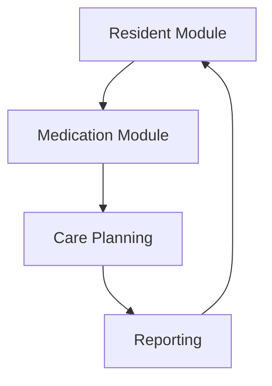
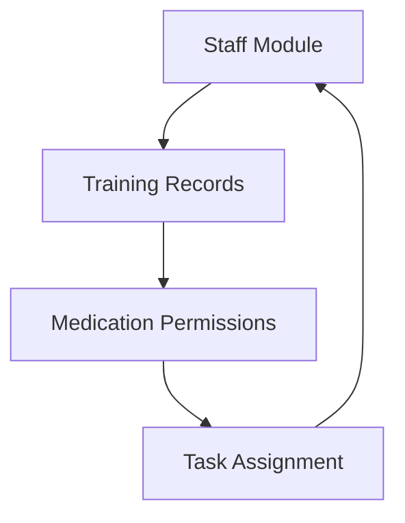

# Medication Module - Platform Integration

## Overview
The Medication Module is a core component of the Write Care Notes platform, seamlessly integrated with other modules to provide comprehensive care home management. This integration ensures consistent data flow, unified user experience, and enhanced functionality across the platform.

## Integration Points

### 1. Core Platform Integration
- **Single Sign-On (SSO)**
  - Unified authentication with main platform
  - Role-based access control
  - Permission inheritance

- **Shared Data Layer**
  - Resident profiles
  - Staff records
  - Care home settings
  - Regional configurations

- **Common UI/UX**
  - Consistent design language
  - Unified navigation
  - Platform-wide notifications
  - Shared components

### 2. Module-Specific Integrations

#### Pain Management Module
- **Real-time Integration**
  - Automatic pain score tracking with medication administration
  - PRN medication effectiveness monitoring
  - Pain pattern correlation with medication schedules
  - Treatment response analysis

- **Shared Assessments**
  - Combined pain and medication assessments
  - Integrated outcome measurements
  - Unified reporting
  - Cross-module analytics

- **Clinical Decision Support**
  - Pain-medication correlation insights
  - Treatment effectiveness tracking
  - Pattern recognition
  - Intervention recommendations

- **Documentation**
  - Unified pain and medication records
  - Integrated care notes
  - Combined audit trails
  - Comprehensive reporting

#### Care Planning Module
- Medication plans linked to care plans
- Automatic care plan updates based on medication changes
- Shared assessment data
- Integrated care reviews

#### Staff Management Module
- Medication administration permissions
- Training records for medication handling
- Staff competency tracking
- Shift management integration

#### Resident Module
- Complete medical history
- Allergy information
- Dietary requirements
- Personal preferences
- GP and pharmacy details

#### Reporting Module
- Integrated medication reports
- Cross-module analytics
- Compliance reporting
- Audit trail integration

### 3. Workflow Integration

#### Daily Tasks
- Medication rounds integrated with daily routines
- Task assignments and notifications
- Handover integration
- Shift planning coordination

#### Notifications
- Platform-wide alert system
- Critical updates distribution
- Task reminders
- Compliance alerts

#### Documentation
- Centralized document management
- Shared templates
- Cross-module record keeping
- Integrated audit trails

### 4. Data Flow

#### Resident Data

#### Staff Data

## Platform Benefits

### 1. Unified Experience
- Single platform login
- Consistent interface
- Integrated workflows
- Seamless navigation

### 2. Enhanced Functionality
- Cross-module features
- Shared data utilization
- Integrated reporting
- Comprehensive analytics

### 3. Improved Efficiency
- Reduced data entry
- Automated workflows
- Streamlined processes
- Resource optimization

### 4. Better Compliance
- Platform-wide audit trail
- Comprehensive reporting
- Integrated evidence gathering
- Cross-module validation

## Technical Integration

### 1. Architecture
- Microservices architecture
- Shared service bus
- Common data models
- Unified API gateway

### 2. Data Management
- Centralized database
- Shared caching layer
- Unified backup system
- Cross-module synchronization

### 3. Security
- Platform-wide encryption
- Unified access control
- Integrated audit logging
- Common security protocols

### 4. Performance
- Load balancing
- Resource sharing
- Optimized caching
- Coordinated scaling

## Implementation Guide

### 1. Setup Requirements
- Platform version compatibility
- Module dependencies
- Integration points checklist
- Configuration requirements

### 2. Configuration Steps
- Module activation
- Permission setup
- Integration testing
- Data migration

### 3. Validation Process
- Integration testing
- Performance validation
- Security checks
- Compliance verification

## Support & Maintenance

### 1. Platform Updates
- Coordinated updates
- Version compatibility
- Feature synchronization
- Bug fix coordination

### 2. Monitoring
- Integrated health checks
- Cross-module diagnostics
- Performance monitoring
- Error tracking

### 3. Support Channels
- Platform-wide support
- Module-specific assistance
- Integration troubleshooting
- Update guidance

## Best Practices

### 1. Implementation
- Follow platform guidelines
- Maintain data consistency
- Regular integration testing
- Performance optimization

### 2. Usage
- Staff training coordination
- Process alignment
- Data management
- Regular audits

### 3. Maintenance
- Regular updates
- Proactive monitoring
- Performance tuning
- Security maintenance 