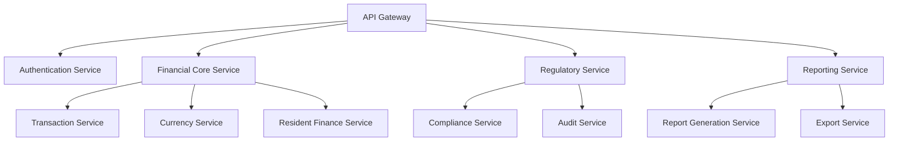
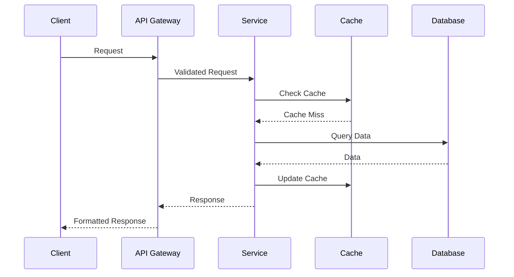
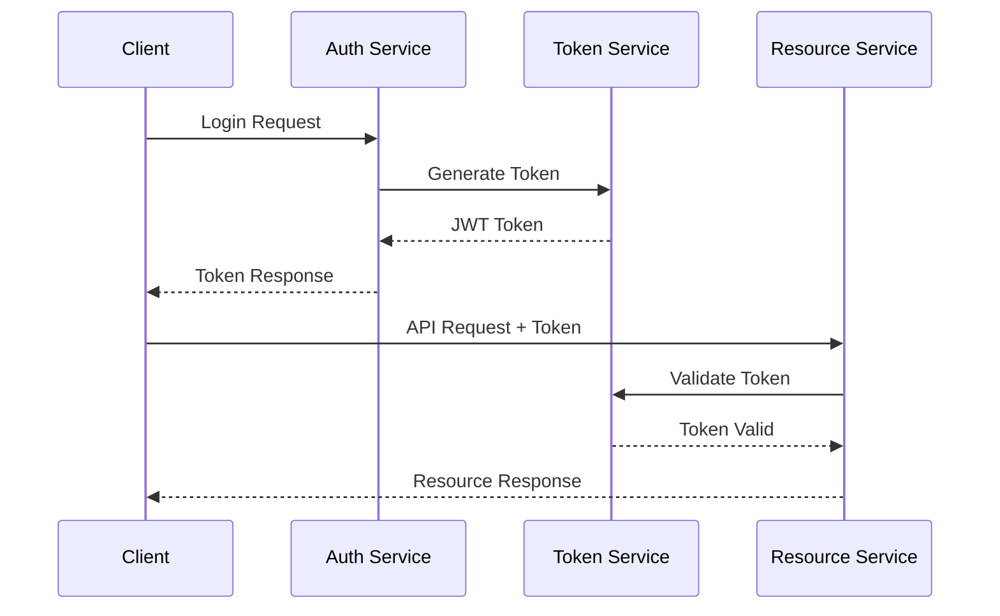

# Financial Module Technical Architecture

## System Overview

The Financial Module is built as a microservices-based system designed to handle financial operations for care homes across the UK and Ireland. The architecture emphasizes scalability, reliability, and regulatory compliance.

## Architecture Components

### Core Services



### Service Descriptions

#### API Gateway
- Route management
- Request validation
- Rate limiting
- API versioning
- Client authentication

#### Authentication Service
- OAuth 2.0 implementation
- JWT token management
- Role-based access control
- Session management
- Multi-factor authentication

#### Financial Core Service
- Transaction processing
- Account management
- Balance tracking
- Financial calculations
- Data validation

#### Regulatory Service
- Compliance checks
- Regional requirements
- Audit logging
- Policy enforcement
- Regulatory reporting

#### Reporting Service
- Report generation
- Data aggregation
- Format conversion
- Template management
- Export handling

## Data Architecture

### Database Schema

```sql
-- Organizations
CREATE TABLE organizations (
    id UUID PRIMARY KEY,
    name TEXT NOT NULL,
    primary_currency TEXT NOT NULL,
    regulatory_body TEXT NOT NULL,
    settings JSONB,
    created_at TIMESTAMPTZ DEFAULT NOW(),
    updated_at TIMESTAMPTZ DEFAULT NOW()
);

-- Transactions
CREATE TABLE transactions (
    id UUID PRIMARY KEY,
    organization_id UUID REFERENCES organizations(id),
    resident_id UUID,
    amount DECIMAL(15,2) NOT NULL,
    currency TEXT NOT NULL,
    type TEXT NOT NULL,
    status TEXT NOT NULL,
    metadata JSONB,
    audit_trail JSONB,
    created_at TIMESTAMPTZ DEFAULT NOW(),
    updated_at TIMESTAMPTZ DEFAULT NOW()
);

-- Exchange Rates
CREATE TABLE exchange_rates (
    id UUID PRIMARY KEY,
    from_currency TEXT NOT NULL,
    to_currency TEXT NOT NULL,
    rate DECIMAL(15,6) NOT NULL,
    provider TEXT NOT NULL,
    valid_from TIMESTAMPTZ NOT NULL,
    valid_to TIMESTAMPTZ NOT NULL,
    created_at TIMESTAMPTZ DEFAULT NOW()
);

-- Audit Logs
CREATE TABLE audit_logs (
    id UUID PRIMARY KEY,
    organization_id UUID REFERENCES organizations(id),
    user_id UUID NOT NULL,
    action TEXT NOT NULL,
    entity_type TEXT NOT NULL,
    entity_id UUID NOT NULL,
    changes JSONB,
    metadata JSONB,
    created_at TIMESTAMPTZ DEFAULT NOW()
);
```

### Data Flow



## Security Architecture

### Authentication Flow



### Security Measures

#### Encryption
- TLS 1.3 for transport
- AES-256 for data at rest
- Key rotation policy
- HSM integration

#### Access Control
- Role-based access
- Resource-level permissions
- IP whitelisting
- Rate limiting

## Performance Optimization

### Caching Strategy

```typescript
interface CacheConfig {
    type: 'redis' | 'memory' | 'distributed';
    ttl: number;
    maxSize: number;
    invalidationPolicy: 'lru' | 'fifo';
}

const cacheConfigs: Record<string, CacheConfig> = {
    exchangeRates: {
        type: 'redis',
        ttl: 3600,
        maxSize: 1000,
        invalidationPolicy: 'lru'
    },
    transactionSummaries: {
        type: 'distributed',
        ttl: 300,
        maxSize: 10000,
        invalidationPolicy: 'fifo'
    }
};
```

### Query Optimization

```sql
-- Indexes for common queries
CREATE INDEX idx_transactions_org_date ON transactions (organization_id, created_at);
CREATE INDEX idx_audit_logs_org_action ON audit_logs (organization_id, action);
CREATE INDEX idx_exchange_rates_currencies ON exchange_rates (from_currency, to_currency);

-- Materialized view for reports
CREATE MATERIALIZED VIEW monthly_summaries AS
SELECT
    organization_id,
    date_trunc('month', created_at) as month,
    currency,
    COUNT(*) as transaction_count,
    SUM(amount) as total_amount
FROM transactions
GROUP BY organization_id, date_trunc('month', created_at), currency;
```

## Offline Support

### Data Synchronization

```typescript
interface SyncConfig {
    priority: 'high' | 'medium' | 'low';
    conflictResolution: 'server-wins' | 'client-wins' | 'manual';
    retryStrategy: {
        maxAttempts: number;
        backoffMs: number;
    };
}

const syncConfigs: Record<string, SyncConfig> = {
    transactions: {
        priority: 'high',
        conflictResolution: 'server-wins',
        retryStrategy: {
            maxAttempts: 3,
            backoffMs: 1000
        }
    }
};
```

### Offline Storage

```typescript
interface OfflineStorage {
    quota: number;
    persistence: 'indexeddb' | 'websql' | 'localstorage';
    encryption: boolean;
    syncInterval: number;
}

const offlineConfig: OfflineStorage = {
    quota: 50 * 1024 * 1024, // 50MB
    persistence: 'indexeddb',
    encryption: true,
    syncInterval: 300000 // 5 minutes
};
```

## Error Handling

### Error Types

```typescript
enum FinancialErrorType {
    VALIDATION_ERROR = 'VALIDATION_ERROR',
    PERMISSION_ERROR = 'PERMISSION_ERROR',
    RATE_LIMIT_ERROR = 'RATE_LIMIT_ERROR',
    COMPLIANCE_ERROR = 'COMPLIANCE_ERROR',
    SYSTEM_ERROR = 'SYSTEM_ERROR'
}

interface ErrorResponse {
    type: FinancialErrorType;
    code: string;
    message: string;
    details?: Record<string, any>;
    help_url?: string;
}
```

### Error Handling Strategy

```typescript
class ErrorHandler {
    static handle(error: Error): ErrorResponse {
        // Log error
        logger.error(error);

        // Notify monitoring
        monitor.notify(error);

        // Return appropriate response
        return {
            type: this.getErrorType(error),
            code: this.getErrorCode(error),
            message: this.getErrorMessage(error),
            details: this.getErrorDetails(error)
        };
    }
}
```

## Monitoring and Analytics

### Metrics Collection

```typescript
interface MetricConfig {
    name: string;
    type: 'counter' | 'gauge' | 'histogram';
    labels: string[];
    help: string;
}

const metrics: MetricConfig[] = [
    {
        name: 'financial_transactions_total',
        type: 'counter',
        labels: ['organization_id', 'type', 'status'],
        help: 'Total number of financial transactions'
    },
    {
        name: 'exchange_rate_requests',
        type: 'histogram',
        labels: ['from_currency', 'to_currency'],
        help: 'Exchange rate request latency'
    }
];
```

### Alerting Rules

```yaml
alerts:
  - name: high_error_rate
    condition: error_rate > 0.05
    duration: 5m
    severity: critical
    channels: [email, slack]

  - name: rate_limit_exceeded
    condition: rate_limit_hits > 100
    duration: 1m
    severity: warning
    channels: [slack]
```

## Deployment Architecture

### Infrastructure

```yaml
services:
  api_gateway:
    replicas: 3
    resources:
      cpu: 2
      memory: 4Gi
    autoscaling:
      min: 3
      max: 10
      metrics:
        - type: cpu
          target: 80%

  financial_core:
    replicas: 5
    resources:
      cpu: 4
      memory: 8Gi
    autoscaling:
      min: 5
      max: 15
      metrics:
        - type: cpu
          target: 70%
        - type: memory
          target: 80%
```

### Deployment Strategy

```yaml
deployment:
  strategy: rolling
  maxSurge: 25%
  maxUnavailable: 25%
  minReadySeconds: 30
  revisionHistoryLimit: 10
  rollbackTo:
    revision: 0
```

## Testing Strategy

### Test Types

```typescript
interface TestConfig {
    type: 'unit' | 'integration' | 'e2e';
    coverage: number;
    timeout: number;
    retries: number;
}

const testConfigs: Record<string, TestConfig> = {
    unit: {
        type: 'unit',
        coverage: 90,
        timeout: 5000,
        retries: 0
    },
    integration: {
        type: 'integration',
        coverage: 80,
        timeout: 30000,
        retries: 2
    },
    e2e: {
        type: 'e2e',
        coverage: 70,
        timeout: 300000,
        retries: 3
    }
};
```

### Performance Testing

```typescript
interface PerformanceTest {
    name: string;
    users: number;
    duration: number;
    thresholds: {
        http_req_duration: string;
        http_req_failed: string;
    };
}

const performanceTests: PerformanceTest[] = [
    {
        name: 'load_test',
        users: 1000,
        duration: 3600,
        thresholds: {
            http_req_duration: 'p95<500',
            http_req_failed: 'rate<0.01'
        }
    }
];
```

## Documentation

### API Documentation

```typescript
interface APIDoc {
    version: string;
    title: string;
    description: string;
    servers: string[];
    security: string[];
    paths: Record<string, any>;
}

const apiDoc: APIDoc = {
    version: '1.0.0',
    title: 'Financial Module API',
    description: 'API for financial operations',
    servers: [
        'https://api.writecarenotes.com/financial/v1'
    ],
    security: ['OAuth2', 'ApiKey'],
    paths: {
        '/transactions': {
            // Path documentation
        }
    }
};
```

### Code Documentation

```typescript
/**
 * @fileoverview Financial module core service
 * @version 1.0.0
 * @license MIT
 */

/**
 * Process a financial transaction
 * @param {Transaction} transaction - The transaction to process
 * @returns {Promise<ProcessedTransaction>} The processed transaction
 * @throws {ValidationError} If the transaction is invalid
 * @throws {ComplianceError} If the transaction violates compliance rules
 */
async function processTransaction(transaction: Transaction): Promise<ProcessedTransaction> {
    // Implementation
}
``` 