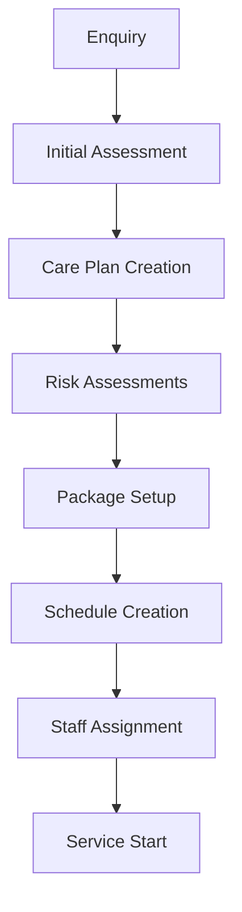
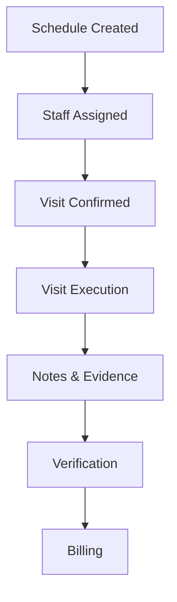
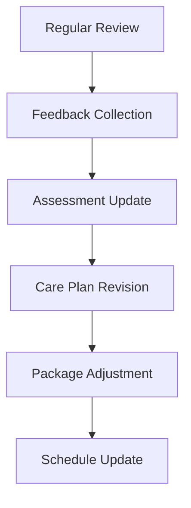

/**
 * @writecarenotes.com
 * @fileoverview Domiciliary Care Integration Guide
 * @version 1.0.0
 * @created 2024-03-21
 * @updated 2024-03-21
 * @author Write Care Notes team
 * @copyright Phibu Cloud Solutions Ltd
 *
 * Description:
 * Comprehensive guide for integrating domiciliary care with other core modules
 * and the signup/onboarding flow.
 */

# Domiciliary Care Integration Guide

## Organization Setup & Signup Flow

### 1. Organization Registration
```typescript
interface DomiciliaryOrganization extends BaseOrganization {
  type: 'DOMICILIARY_CARE';
  services: {
    personalCare: boolean;
    medicationSupport: boolean;
    mealPreparation: boolean;
    domesticSupport: boolean;
    respiteCare: boolean;
    liveinCare: boolean;
    specialistCare: boolean;
  };
  operatingRegions: {
    postcodes: string[];
    localAuthorities: string[];
  };
  compliance: {
    regulatoryBody: 'CQC' | 'CIW' | 'RQIA' | 'CI' | 'HIQA';
    registrationNumber: string;
    registrationDate: Date;
    lastInspection?: Date;
    rating?: string;
  };
}
```

### 2. Registration Steps
1. Basic Organization Info
   - Organization name
   - Registration type (Domiciliary)
   - Contact details
   - Operating regions

2. Service Configuration
   - Service types offered
   - Operating hours
   - Service areas (postcodes)
   - Staff requirements

3. Compliance Setup
   - Regulatory body selection
   - Registration details
   - Policy requirements
   - Insurance verification

4. System Configuration
   - Visit duration defaults
   - Travel time allowances
   - Break requirements
   - On-call arrangements

## Module Integrations

### 1. Care Plans Module
```typescript
interface DomiciliaryCareplan extends Careplan {
  // Domiciliary-specific fields
  visitRequirements: {
    preferredTimes: TimeSlot[];
    duration: number;
    staffingRequirements: {
      gender?: 'MALE' | 'FEMALE';
      skills: string[];
      continuityPreference: boolean;
    };
    access: {
      keySafe?: boolean;
      keySafeLocation?: string;
      accessNotes?: string;
    };
  };
  
  // Risk assessments
  environmentalRisks: {
    location: RiskAssessment;
    access: RiskAssessment;
    equipment: RiskAssessment;
  };
  
  // Service delivery
  tasks: {
    personal: CareTask[];
    medication: CareTask[];
    domestic: CareTask[];
    social: CareTask[];
  };
}
```

### 2. Assessment Module
```typescript
interface DomiciliaryAssessment extends Assessment {
  // Home environment
  environment: {
    propertyType: string;
    access: AccessAssessment;
    rooms: RoomAssessment[];
    hazards: HazardAssessment[];
  };
  
  // Support network
  support: {
    familyCarers: Contact[];
    professionals: Professional[];
    emergencyContacts: Contact[];
  };
  
  // Service requirements
  requirements: {
    personal: NeedAssessment[];
    domestic: NeedAssessment[];
    social: NeedAssessment[];
    medical: NeedAssessment[];
  };
}
```

### 3. Medication Module
```typescript
interface DomiciliaryMedication extends Medication {
  // Storage location
  storage: {
    location: string;
    access: string;
    temperature: boolean;
    secure: boolean;
  };
  
  // Administration
  administration: {
    timing: TimeSlot[];
    support: 'PROMPT' | 'ASSIST' | 'ADMINISTER';
    specialInstructions: string;
  };
  
  // Compliance
  compliance: {
    mar: MARChart;
    stockChecks: StockCheck[];
    returns: MedicationReturn[];
  };
}
```

### 4. Activities Module
```typescript
interface DomiciliaryActivity extends Activity {
  // Activity location
  location: 'CLIENT_HOME' | 'COMMUNITY' | 'OTHER';
  
  // Support required
  support: {
    staffing: number;
    equipment: string[];
    riskAssessment: RiskAssessment;
  };
  
  // Integration
  integration: {
    careplan: string;
    outcomes: Outcome[];
    evidence: Evidence[];
  };
}
```

### 5. Staff Module
```typescript
interface DomiciliaryStaff extends Staff {
  // Travel
  travel: {
    mode: 'CAR' | 'PUBLIC_TRANSPORT' | 'WALKING';
    license?: DrivingLicense;
    vehicle?: VehicleDetails;
    territories: Territory[];
  };
  
  // Availability
  availability: {
    regularHours: WorkingHours[];
    exceptions: DateRange[];
    preferences: TimeSlot[];
  };
  
  // Skills & Training
  qualifications: {
    care: Qualification[];
    specialist: Qualification[];
    mandatory: Training[];
  };
}
```

## Workflow Integration

### 1. Client Onboarding


### 2. Visit Management


### 3. Care Review Process


## Cross-Module Features

### 1. Document Management
- Care plans
- Risk assessments
- Visit logs
- MAR charts
- Training records
- Policies & procedures

### 2. Communication
- Client updates
- Staff notifications
- Family portal
- Professional network
- Emergency alerts

### 3. Quality Monitoring
- Spot checks
- Satisfaction surveys
- Complaint handling
- Incident reporting
- Outcome tracking

### 4. Compliance Management
- Registration
- Policies
- Training
- Audits
- Inspections

## Technical Integration

### 1. Data Synchronization
```typescript
interface SyncConfig {
  modules: {
    carePlans: {
      syncInterval: number;
      priority: number;
    };
    medications: {
      syncInterval: number;
      priority: number;
    };
    activities: {
      syncInterval: number;
      priority: number;
    };
  };
  offline: {
    storage: StorageConfig;
    priority: PriorityConfig;
    conflict: ConflictConfig;
  };
}
```

### 2. Event System
```typescript
interface DomiciliaryEvents {
  // Care Plan Events
  'careplan:created': CareplanEvent;
  'careplan:updated': CareplanEvent;
  'careplan:reviewed': CareplanEvent;
  
  // Visit Events
  'visit:scheduled': VisitEvent;
  'visit:started': VisitEvent;
  'visit:completed': VisitEvent;
  'visit:missed': VisitEvent;
  
  // Medication Events
  'medication:due': MedicationEvent;
  'medication:given': MedicationEvent;
  'medication:missed': MedicationEvent;
  
  // Assessment Events
  'assessment:due': AssessmentEvent;
  'assessment:completed': AssessmentEvent;
  'risk:identified': RiskEvent;
}
```

### 3. API Integration
```typescript
interface APIConfig {
  endpoints: {
    base: string;
    version: string;
    modules: {
      carePlans: string;
      medications: string;
      activities: string;
      assessments: string;
    };
  };
  authentication: {
    type: 'JWT';
    scope: string[];
    refresh: boolean;
  };
  rateLimit: {
    window: number;
    max: number;
  };
}
```

## Notes

1. Organization Setup:
   - Configure as domiciliary provider
   - Set service boundaries
   - Define operational parameters
   - Setup compliance framework

2. Module Dependencies:
   - Care Plans (required)
   - Medications (required)
   - Assessments (required)
   - Activities (optional)
   - Staff (required)

3. Integration Points:
   - Data synchronization
   - Event handling
   - API endpoints
   - Offline capabilities

4. Compliance Requirements:
   - Data protection
   - Record keeping
   - Staff qualifications
   - Service standards
   - Quality monitoring 