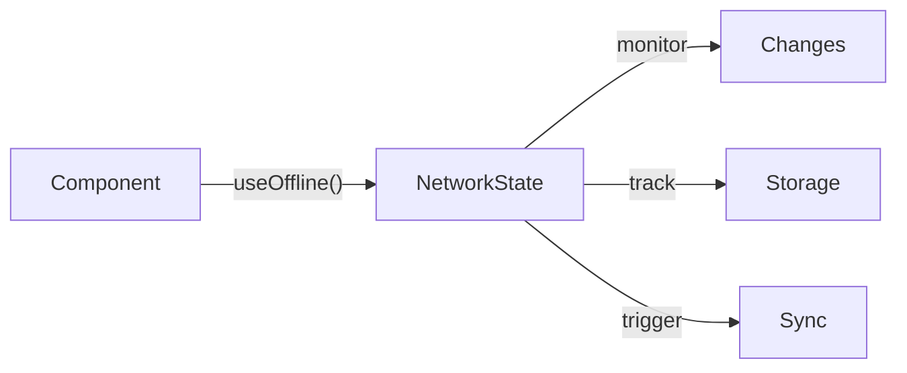
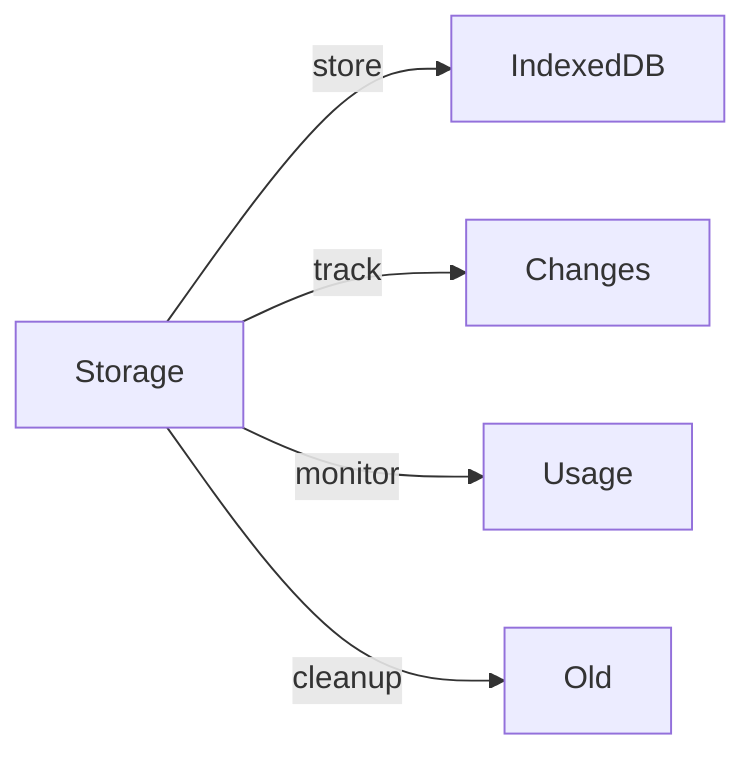
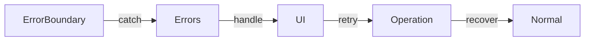

# Write Care Notes - Offline Scheduling Architecture

## Overview

The offline scheduling module ensures continuous access to critical scheduling functionality in Write Care Notes, even without internet connectivity. This enterprise-grade solution is designed for UK and Ireland care homes, focusing on staff scheduling, shift management, and compliance requirements.

## Core Principles

- **Care Continuity**: Uninterrupted access to critical schedules
- **Compliance**: CQC and HIQA standards adherence
- **Data Integrity**: Guaranteed schedule consistency
- **Multi-Region**: UK & Ireland time zone support
- **Enterprise Security**: Role-based offline access
- **Mobile-First**: Optimized for care staff devices

## Directory Structure

```bash
src/
├── features/
│   └── offline/
│       ├── api/
│       │   ├── sync.ts                 # Sync endpoints
│       │   └── index.ts                # API exports
│       ├── components/
│       │   ├── OfflineIndicator.tsx    # Online/offline status UI
│       │   └── OfflineErrorBoundary.tsx # Error handling
│       ├── hooks/
│       │   └── useOffline.ts           # Offline state management
│       ├── utils/
│       │   └── storage.ts              # IndexedDB wrapper
│       ├── types/
│       │   ├── index.ts                # Core types
│       │   └── errors.ts               # Error classes
│       ├── config/
│       │   └── constants.ts            # Configuration
│       ├── CHANGELOG.md                # Version history
│       ├── FEATURES.md                 # Feature documentation
│       ├── types.ts                    # Type definitions
│       └── index.ts                    # Module exports
└── __tests__/
    └── offline/
        ├── components.test.ts          # Component tests
        ├── hooks.test.ts              # Hook tests
        └── storage.test.ts            # Storage tests
```

## Core Components

### 1. API Layer
- **Purpose**: Backend communication
- **Features**:
  - Change synchronization with retry
  - Data validation with timeouts
  - Timestamp management
  - Error handling with custom types
  - Exponential backoff retry

### 2. Error System
- **Purpose**: Robust error handling
- **Features**:
  - Custom error classes
  - Type-safe error handling
  - Error recovery mechanisms
  - User-friendly messages
  - Debug information

### 3. Configuration
- **Purpose**: Centralized settings
- **Features**:
  - Environment-specific config
  - Timeout settings
  - Retry parameters
  - Storage limits
  - API endpoints

### 4. OfflineIndicator
- **Purpose**: Visual status indicator
- **Features**:
  - Online/offline status display
  - Sync status monitoring
  - Storage usage tracking
  - Pending changes counter
  - Manual sync trigger

### 5. OfflineErrorBoundary
- **Purpose**: Error handling wrapper
- **Features**:
  - Graceful degradation
  - Network error handling
  - Offline-specific errors
  - User-friendly messages
  - Retry mechanisms

### 6. Storage Manager
- **Purpose**: Local data persistence
- **Features**:
  - IndexedDB management
  - Change tracking
  - Sync operations
  - Storage monitoring
  - Data cleanup

## React Integration

### 1. Hooks and Components
```typescript
import {
  OfflineIndicator,
  OfflineErrorBoundary,
  useOffline,
  SyncError,
  OFFLINE_CONFIG
} from '@features/offline';

function ScheduleComponent() {
  const {
    isOnline,
    isSyncing,
    pendingChanges,
    storageUsage,
    forceSync
  } = useOffline();

  const handleSync = async () => {
    try {
      await forceSync();
    } catch (error) {
      if (error instanceof SyncError) {
        // Handle sync error
      }
    }
  };

  return (
    <OfflineErrorBoundary>
      <OfflineIndicator />
      <Schedule />
      {storageUsage.percentage > OFFLINE_CONFIG.STORAGE.WARNING_THRESHOLD && (
        <StorageWarning usage={storageUsage} />
      )}
    </OfflineErrorBoundary>
  );
}
```

## Data Flow

1. **Offline State Management**


2. **Data Storage**


3. **Error Handling**


## Security & Compliance

1. **Data Protection**
   - Schedule encryption at rest
   - Staff PII protection
   - GDPR-compliant storage
   - Secure credential handling

2. **Access Control**
   - Role-based schedule access
   - Department-level isolation
   - Time-based restrictions
   - Device registration

3. **Compliance Requirements**
   - Working Time Directive
   - CQC scheduling standards
   - HIQA staff requirements
   - Audit trail maintenance

## Error Handling

1. **Schedule Conflicts**
   - Double-booking prevention
   - Staff availability checks
   - Shift overlap detection
   - Resolution workflows

2. **Sync Issues**
   - Roster consistency
   - Time record accuracy
   - Change validation
   - Version control

3. **Compliance Violations**
   - Working hours limits
   - Required break times
   - Qualification checks
   - Alert mechanisms

## Testing

### Unit Tests
```bash
# Run schedule tests
pnpm test schedule/offline

# Test specific features
pnpm test schedule/time-attendance
```

### Test Coverage
- Shift management
- Time recording
- Staff notifications
- Compliance rules

## Performance Optimization

1. **Mobile Performance**
   - Compressed schedule data
   - Incremental sync
   - Battery-aware updates
   - Efficient rendering

2. **Storage Management**
   - Schedule prioritization
   - Historical data archival
   - Cache optimization
   - Resource cleanup

3. **Network Usage**
   - Delta updates
   - Batch synchronization
   - Bandwidth monitoring
   - Connectivity detection

## Best Practices

1. **Schedule Management**
   - Regular sync intervals
   - Conflict prevention
   - Staff notification timing
   - Emergency procedures

2. **Data Handling**
   - Schedule validation
   - Time zone conversion
   - Break calculation
   - Overtime tracking

3. **Compliance**
   - Regular audits
   - Policy enforcement
   - Documentation
   - Training records

## Troubleshooting

1. **Common Issues**
   - Shift sync failures
   - Time record discrepancies
   - Staff notification delays
   - Compliance alerts

2. **Debugging Tools**
   - Schedule inspector
   - Sync monitor
   - Compliance checker
   - Audit viewer

3. **Support Procedures**
   - Issue escalation
   - Data recovery
   - Emergency support
   - Staff assistance
