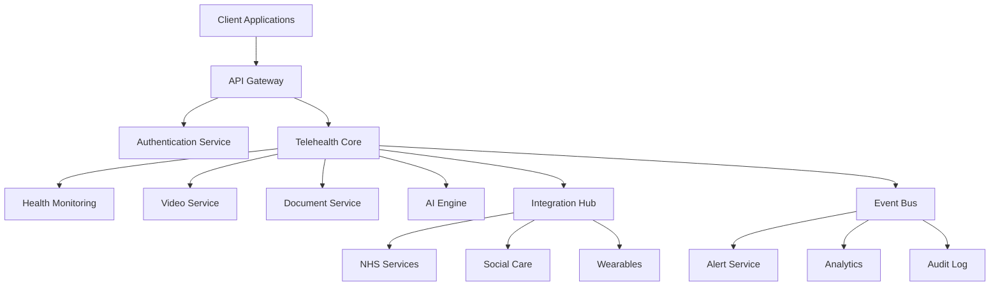
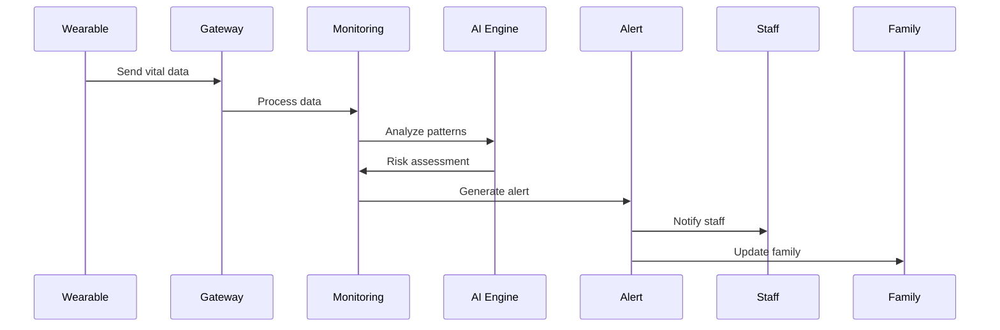
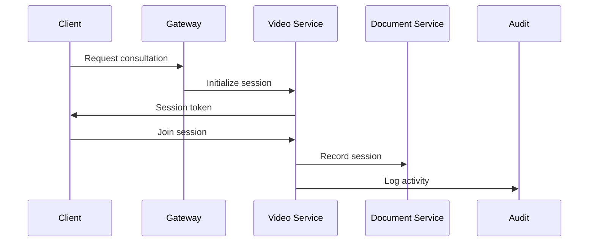
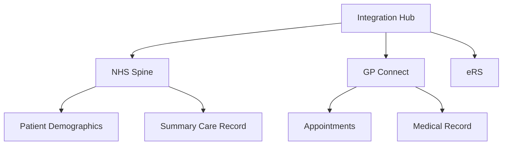
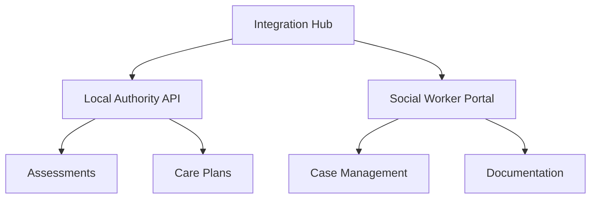
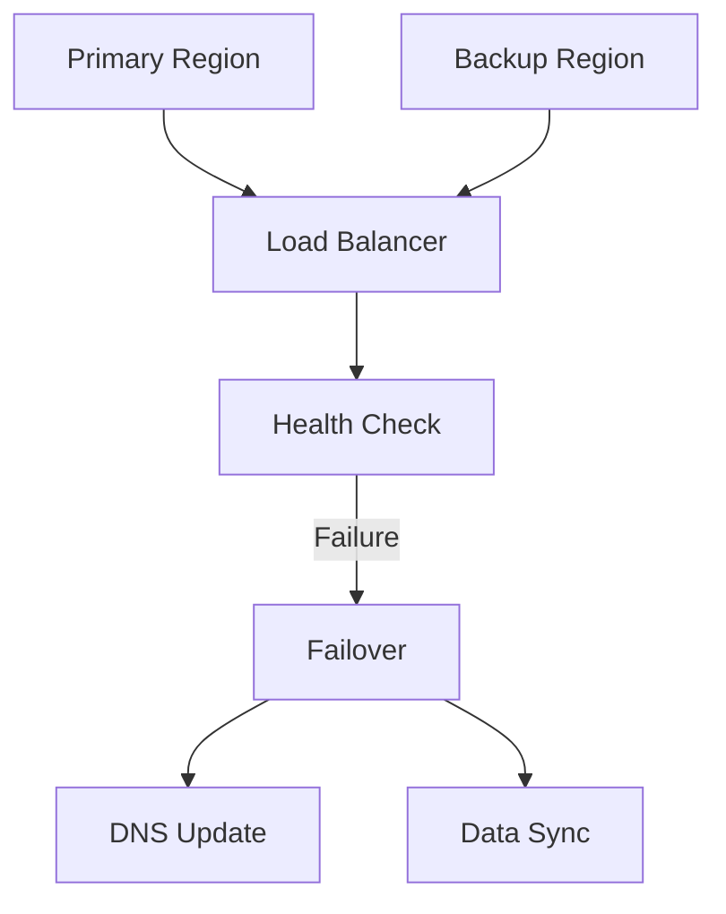
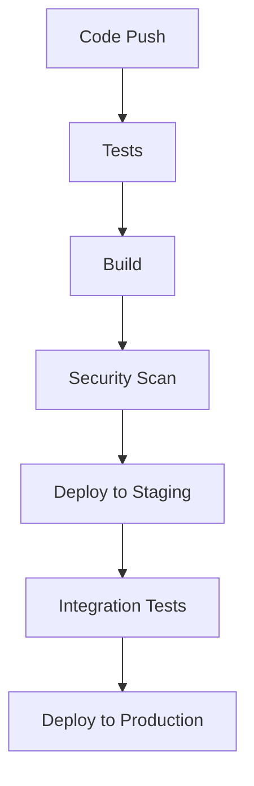

# Telehealth Module Architecture

## System Overview

The Write Care Notes Telehealth Module is built on a modern, scalable architecture designed for enterprise-grade healthcare applications.



## Core Components

### 1. API Gateway
- Rate limiting
- Request validation
- Regional routing
- Load balancing
- SSL termination

### 2. Authentication Service
- JWT-based authentication
- Role-based access control
- Multi-factor authentication
- Session management
- Token refresh

### 3. Telehealth Core
- Consultation management
- Video session coordination
- Document handling
- Care plan management
- Real-time monitoring

### 4. Health Monitoring
- Vital signs tracking
- Wearable data processing
- Alert generation
- Trend analysis
- Emergency response

### 5. AI Engine
- Fall prediction
- Behavior analysis
- Medication optimization
- Staff scheduling
- Predictive analytics

## Data Flow

### 1. Real-time Monitoring Flow


### 2. Video Consultation Flow


## Security Model

### 1. Authentication
- JWT tokens with short expiry
- Refresh token rotation
- Device fingerprinting
- IP validation
- Rate limiting

### 2. Authorization
```typescript
interface AuthContext {
  user: {
    id: string;
    role: UserRole;
    permissions: Permission[];
    organization: string;
  };
  session: {
    id: string;
    device: string;
    expires: Date;
  };
  region: Region;
}
```

### 3. Data Protection
- End-to-end encryption
- At-rest encryption
- Data masking
- Secure audit logs
- Access controls

## Integration Architecture

### 1. NHS Integration


### 2. Social Care Integration


## Scalability

### 1. Horizontal Scaling
- Stateless services
- Load balancing
- Service discovery
- Auto-scaling
- Regional deployment

### 2. Data Partitioning
```sql
-- Multi-tenant data structure
CREATE TABLE consultations (
    id UUID PRIMARY KEY,
    organization_id UUID NOT NULL,
    region VARCHAR(3) NOT NULL,
    data JSONB,
    created_at TIMESTAMPTZ DEFAULT NOW(),
    PARTITION BY LIST (region)
);
```

## Monitoring & Observability

### 1. Health Metrics
- Service health
- API latency
- Error rates
- Resource usage
- Network status

### 2. Business Metrics
- Active consultations
- Alert response time
- AI prediction accuracy
- Staff utilization
- Family engagement

### 3. Audit Trail
```typescript
interface AuditEvent {
  id: string;
  timestamp: Date;
  actor: {
    id: string;
    role: string;
  };
  action: string;
  resource: {
    type: string;
    id: string;
  };
  context: {
    region: string;
    organization: string;
    ip: string;
  };
  changes: {
    before: any;
    after: any;
  };
}
```

## Disaster Recovery

### 1. Backup Strategy
- Real-time replication
- Point-in-time recovery
- Geographic redundancy
- Encrypted backups
- Regular testing

### 2. Failover Process


## Performance Optimization

### 1. Caching Strategy
- Redis for session data
- CDN for static assets
- Query caching
- Response caching
- Cache invalidation

### 2. Database Optimization
```sql
-- Optimized queries with indexes
CREATE INDEX idx_consultations_region_date 
ON consultations(region, created_at);

CREATE INDEX idx_monitoring_resident_vital 
ON vital_signs(resident_id, recorded_at);
```

## Development Workflow

### 1. CI/CD Pipeline


### 2. Environment Management
- Development
- Testing
- Staging
- Production
- DR Site

## API Design

### 1. RESTful Endpoints
```typescript
interface APIEndpoint {
  path: string;
  method: HTTPMethod;
  auth: AuthRequirement;
  rateLimit: RateLimit;
  validation: SchemaValidation;
  response: ResponseSchema;
}
```

### 2. WebSocket Events
```typescript
interface WebSocketEvent {
  type: EventType;
  payload: any;
  metadata: {
    timestamp: Date;
    source: string;
    version: string;
  };
}
```

## Configuration Management

### 1. Environment Variables
```env
# Service Configuration
SERVICE_NAME=telehealth
SERVICE_VERSION=1.0.0
NODE_ENV=production

# Database Configuration
DB_HOST=localhost
DB_PORT=5432
DB_NAME=telehealth
DB_USER=app
DB_PASSWORD=secure_password

# Integration Keys
NHS_API_KEY=xxx
SOCIAL_CARE_API_KEY=xxx
```

### 2. Feature Flags
```typescript
interface FeatureFlags {
  aiPredictions: boolean;
  wearableIntegration: boolean;
  videoConsultations: boolean;
  nhsIntegration: boolean;
}
``` 