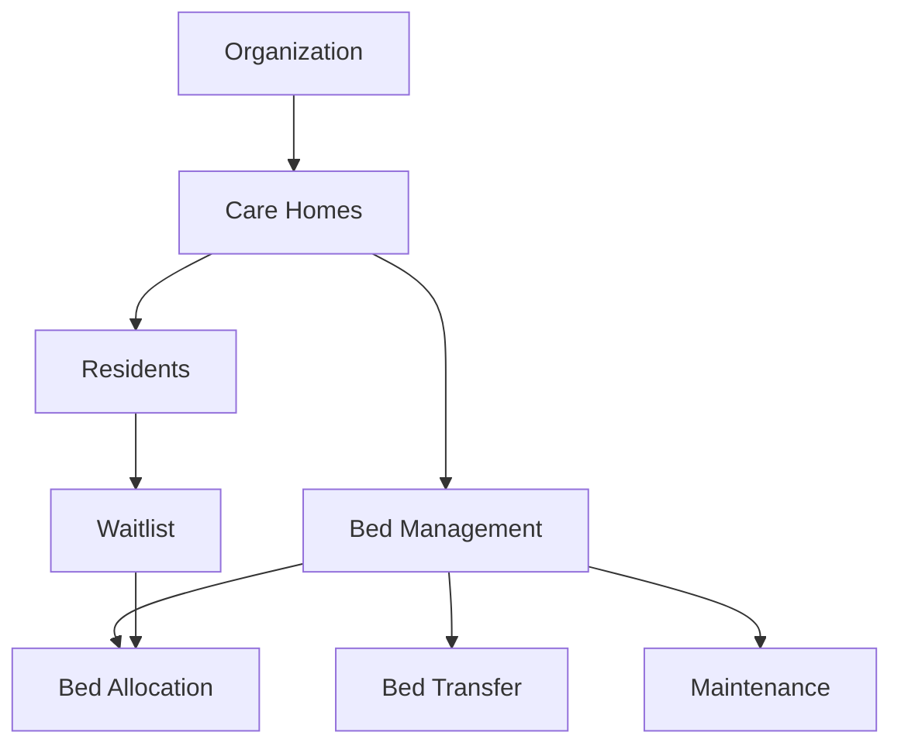
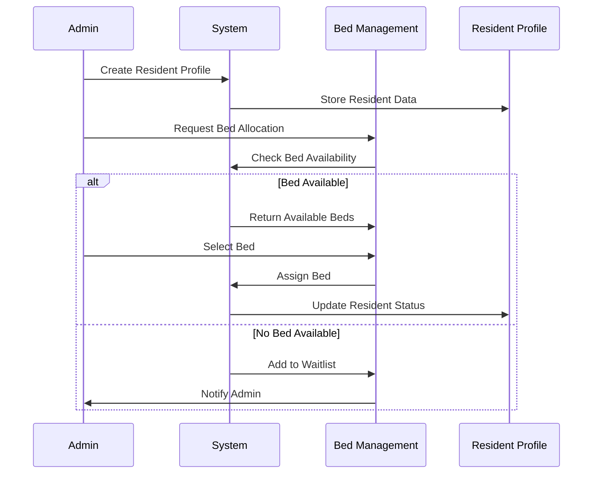
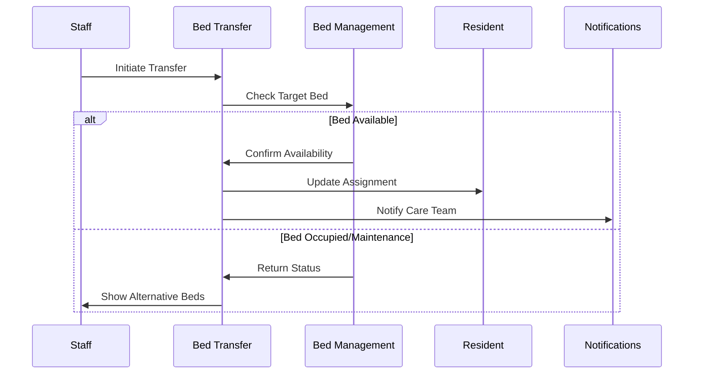
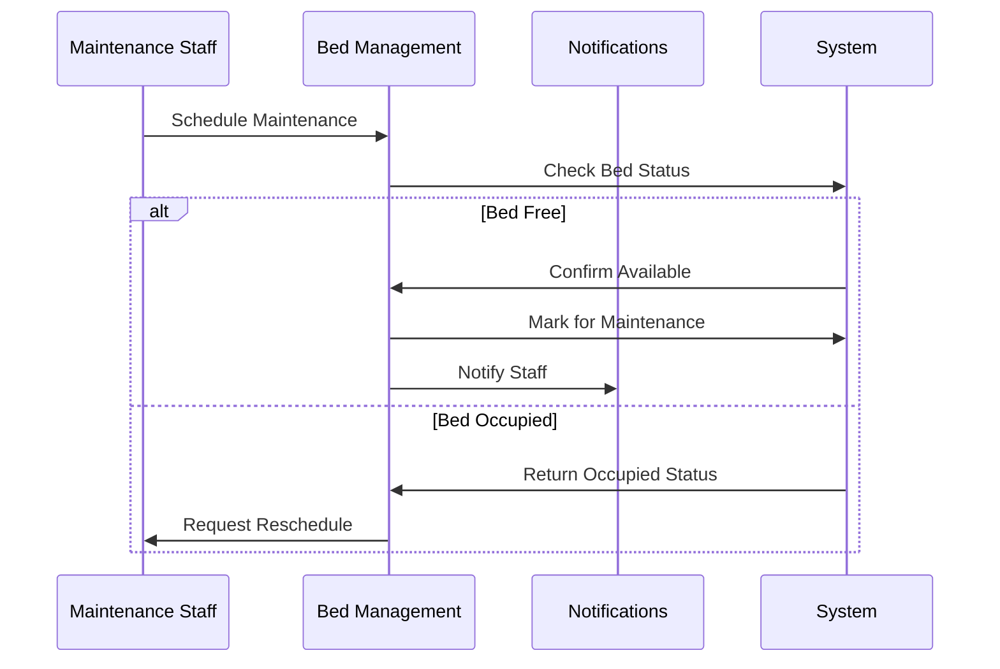
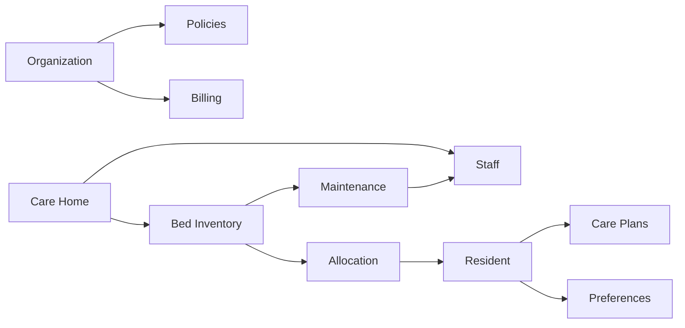

# Bed Management Workflow

## System Integration Overview

## Hierarchical Structure

1. **Organization Level**
   - Multi-tenant support
   - Regional settings
   - Global policies
   - License management
   - Billing configuration

2. **Care Home Level**
   - Bed inventory
   - Staff management
   - Facility settings
   - Local policies
   - Resource allocation

3. **Resident Level**
   - Care requirements
   - Bed assignments
   - Medical needs
   - Preferences
   - History

## Core Workflows

### 1. New Resident Admission

### 2. Bed Transfer Process

### 3. Maintenance Workflow

## Integration Points

### 1. Care Home Integration
- Bed inventory sync
- Staff access control
- Facility-specific settings
- Resource management
- Local policy enforcement

### 2. Resident Integration
- Medical records link
- Care plan integration
- Preference management
- History tracking
- Family contact info

### 3. Organization Integration
- Multi-facility management
- Cross-facility transfers
- Global reporting
- Policy management
- Billing integration

## Data Flow

## Access Control

### Organization Level
- Global administrators
- Financial managers
- Regional directors
- Policy makers

### Care Home Level
- Home managers
- Care coordinators
- Medical staff
- Maintenance staff

### Resident Level
- Care workers
- Medical staff
- Family members
- Support staff

## Event Triggers

1. **Resident Events**
   - New admission
   - Discharge
   - Transfer request
   - Care plan update

2. **Bed Events**
   - Allocation
   - Release
   - Maintenance start/end
   - Status change

3. **Organization Events**
   - Policy updates
   - Staff changes
   - Facility updates
   - Configuration changes

## Reporting Structure

1. **Organization Reports**
   - Occupancy rates
   - Transfer patterns
   - Maintenance costs
   - Revenue analysis

2. **Care Home Reports**
   - Bed utilization
   - Staff efficiency
   - Maintenance schedules
   - Incident reports

3. **Resident Reports**
   - Length of stay
   - Transfer history
   - Care plan compliance
   - Satisfaction metrics
