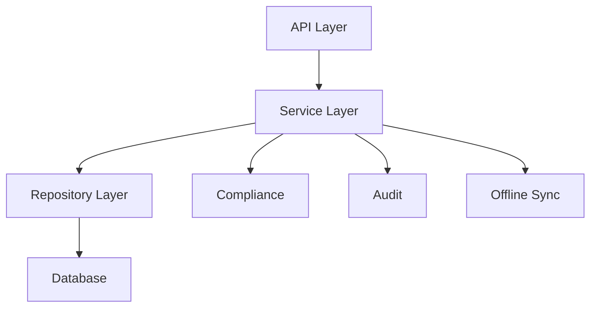

# Organization Module

## Overview
The organization module provides enterprise-grade organization management capabilities for the Write Care Notes platform.

## Features
- Multi-tenant organization management
- Compliance framework integration
- Offline capabilities
- Audit logging
- Enterprise-grade validation

## Architecture


## Components
- `organizationService.ts` - Business logic layer
- `organizationRepository.ts` - Data access layer
- `useOrganizationContext.ts` - React hook for state management
- `routes.ts` - API endpoints

## Usage Examples

### Creating an Organization
```typescript
const org = await organizationService.createOrganization({
  name: "Care Home Ltd",
  type: "MULTI_SITE",
  region: "GB-ENG"
});
```

### Adding a Care Home
```typescript
const updated = await organizationService.addCareHome(
  orgId,
  careHomeData
);
```

## API Documentation

### GET /api/organizations
Get a list of organizations or a specific organization.

Query Parameters:
- `id` (optional) - Get specific organization
- `page` (optional) - Page number
- `limit` (optional) - Items per page

### POST /api/organizations
Create a new organization.

Request Body:
```typescript
{
  name: string;
  type: "SINGLE_SITE" | "MULTI_SITE" | "CORPORATE" | "FRANCHISE";
  region: string;
  settings?: OrganizationSettings;
}
```

## Security

### Authentication
All endpoints require authentication using JWT tokens.

### Authorization
Role-based access control (RBAC) is implemented for all operations.

### Data Protection
- Tenant isolation
- Field-level encryption
- Audit logging
- GDPR compliance

## Deployment

### Prerequisites
- Node.js 18+
- PostgreSQL 14+
- Redis 6+

### Environment Variables
```env
DATABASE_URL=postgresql://...
REDIS_URL=redis://...
```

### Installation
```bash
npm install
npm run migrate
npm run seed
```

## Testing

### Unit Tests
```bash
npm run test:unit
```

### Integration Tests
```bash
npm run test:integration
```

### E2E Tests
```bash
npm run test:e2e
```

## Monitoring

### Health Checks
- `/health` - Service health
- `/metrics` - Prometheus metrics

### Logging
Uses structured logging with the following levels:
- ERROR - Service errors
- WARN - Important warnings
- INFO - General information
- DEBUG - Debug information

## Troubleshooting

### Common Issues

1. Organization Creation Fails
```typescript
// Check compliance validation
await compliance.validateCompliance(orgData);
```

2. Offline Sync Issues
```typescript
// Check sync queue status
const status = await offlineSync.getQueueStatus();
```

## Support
For enterprise support, contact support@writecarenotes.com