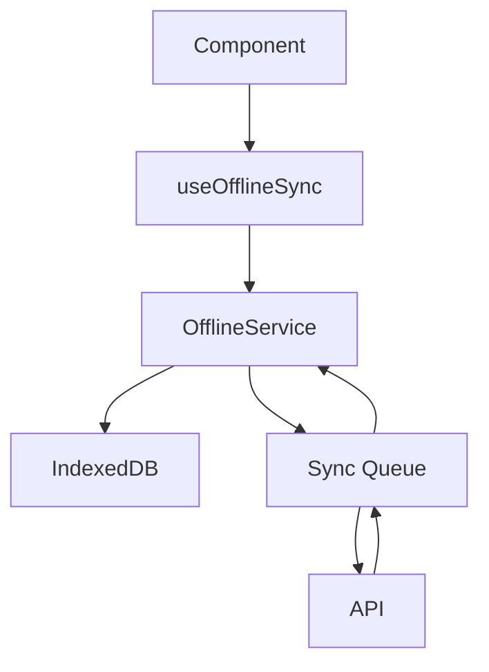

# Write Care Notes Offline Module

## Overview

The Write Care Notes Offline Module provides enterprise-grade offline capabilities for care home management applications. It implements a robust offline-first architecture with secure data synchronization, conflict resolution, and compliance with UK and Ireland healthcare regulations.

## Features

- **Offline-First Architecture**: Seamless operation with or without internet connectivity
- **Secure Data Storage**: AES-256 encryption for sensitive healthcare data
- **Efficient Synchronization**: Queue-based sync with conflict resolution
- **Compliance Ready**: Meets CQC, OFSTED, CIW, CI, and RQIA requirements
- **Enterprise Grade**: Built for scale and reliability
- **Type Safe**: Full TypeScript support with comprehensive type definitions

## Installation

The offline module is an integral part of the Write Care Notes platform. It's included in the main package and requires no additional installation.

## Usage

### Basic Usage

```typescript
import { useOfflineSync } from '@/lib/offline/hooks/useOfflineSync';

function MyComponent() {
  const {
    saveData,
    getData,
    getAll,
    status,
    isInitialized,
    error,
    syncProgress,
    forceSyncNow
  } = useOfflineSync({
    storeName: 'medications',
    onSyncComplete: (event) => console.log('Sync completed:', event),
    onSyncError: (error) => console.error('Sync failed:', error),
    onNetworkChange: (isOnline) => console.log('Network status:', isOnline),
    onStorageWarning: (usage, quota) => console.warn('Storage warning:', { usage, quota })
  });

  // Save data
  await saveData('123', {
    id: '123',
    name: 'Medication Name',
    dosage: '10mg'
  });

  // Get data
  const data = await getData('123');

  // Force sync
  await forceSyncNow();
}
```

### Advanced Usage

```typescript
import { OfflineService } from '@/lib/offline/offlineService';
import { SyncStrategy } from '@/lib/offline/types';

// Create service instance with custom configuration
const service = new OfflineService('medications', {
  syncStrategy: SyncStrategy.LAST_WRITE_WINS,
  maxRetries: 5,
  retryDelay: 1000,
  maxQueueSize: 1000,
  encryptData: true,
  compressionEnabled: true,
  logLevel: 'info'
});

// Initialize service
await service.init();

// Subscribe to events
service.on('offline:sync:completed', (event) => {
  console.log('Sync completed:', event);
});

// Save data with options
await service.saveData('123', data, {
  skipSync: false,
  priority: 'high',
  encrypt: true,
  compress: true
});

// Get service status
const status = await service.getStatus();
```

## Architecture

### Core Components

1. **OfflineService**: Main service class handling data operations
2. **React Hooks**: Easy-to-use React integration
3. **Type Definitions**: Comprehensive TypeScript types
4. **Utilities**: Encryption, compression, and helper functions

### Data Flow



### Sync Process

1. Data is saved locally first
2. Changes are queued for synchronization
3. Queue is processed when online
4. Conflicts are resolved according to strategy
5. Success/failure is reported back

## Configuration

### Sync Strategies

- `LAST_WRITE_WINS`: Latest change takes precedence
- `SERVER_WINS`: Server data takes precedence
- `CLIENT_WINS`: Local data takes precedence
- `MANUAL`: Manual conflict resolution required

### Storage Limits

- Maximum item size: 5MB
- Warning threshold: 80% usage
- Critical threshold: 90% usage

### Security

- Encryption: AES-256-GCM
- Key rotation: 30 days
- Compression: Enabled by default
- Audit logging: Enabled by default

## Compliance

### Data Protection

- GDPR compliance
- Data Protection Act 2018
- NHS Data Security Standards
- Cyber Essentials Plus

### Healthcare Standards

- CQC Fundamental Standards
- OFSTED Requirements
- NICE Guidelines
- Regional Care Standards

## Error Handling

### Error Codes

- `NOT_INITIALIZED`: Service not properly initialized
- `STORE_NOT_FOUND`: Requested store doesn't exist
- `QUOTA_EXCEEDED`: Storage quota exceeded
- `NETWORK_ERROR`: Network connectivity issues
- `SYNC_CONFLICT`: Data synchronization conflicts
- `INVALID_DATA`: Data validation failures
- `PERMISSION_DENIED`: Insufficient permissions

### Error Recovery

1. Automatic retry with exponential backoff
2. Conflict resolution strategies
3. Data validation before storage
4. Quota management
5. Network status monitoring

## Performance

### Optimization Strategies

- Efficient data compression
- Batch synchronization
- Incremental updates
- Cache management
- Storage optimization

### Monitoring

- Sync progress tracking
- Storage usage monitoring
- Network status tracking
- Performance metrics
- Error tracking

## Testing

### Test Coverage

- Unit tests for core functionality
- Integration tests for sync process
- End-to-end tests for offline scenarios
- Performance benchmarks
- Security testing

### Test Environment

```typescript
// Setup test environment
import { setupOfflineTests } from '@/lib/offline/__tests__/setup';

describe('OfflineService', () => {
  beforeEach(async () => {
    await setupOfflineTests();
  });

  test('should handle offline operations', async () => {
    // Test implementation
  });
});
```

## Contributing

1. Follow TypeScript best practices
2. Maintain test coverage
3. Update documentation
4. Follow security guidelines
5. Consider compliance requirements

## License

Copyright © 2024 Phibu Cloud Solutions Ltd. All rights reserved. 